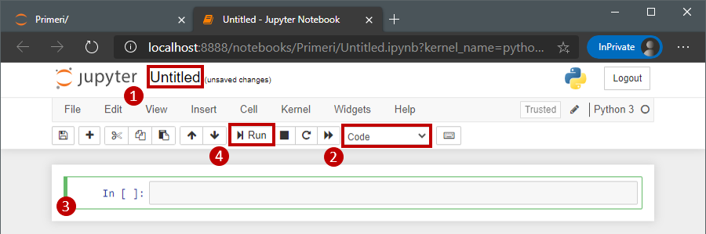

---
tags:
  - JupyterLab
  - Jupyter Notebook
  - Anaconda
  - Markdown
  - pandas
  - seaborn
  - Matplotlib
---

# Vzpostavitev okolja

Za namen prikaza praktičnih primerov bo v tej knjigi uporabljen programski jezik Python, saj je en izmed bolj priljubljenih programskih jezikov z odličnim naborom knjižnic strojnega učenja. Za razumevanje primerov je vsekakor priporočljivo poznavanje tega programskega jezika ali vsaj splošno poznavanje enega izmed modernih programskih jezikov (Java, Perl, C#, R, C, C++). Sledijo navodila vzpostavitve okolja, primernega za izvedbo praktičnih primerov na svojem računalniku.

## Razvojno okolje Jupyter Notebook
Vsi praktični primeri v knjigi so prikazani tako, da se brez težave izvedejo v [JupyterLab](http://jupyterlab.io/) okolju. To razvojno okolje omogoča pisanje Python programske kode v tako imenovanih Jupyter zvezkih (angl. _Jupyter notebooks_). 

Ti zvezki se urejajo v poljubnem spletnem brskalniku in zato za urejanje ne potrebujejo namenskega orodja. Posebnost kode, zapisane v Jupyter zvezkih, je, da je ta v eni datoteki (zvezku) mešana s takojšnjimi izpisi kode in navodili, ki jih razvijalci zapišemo sproti za razlago delovanja kode. Zvezki so razdeljeni na tako imenovane celice, kjer je celica bodisi navodilo ali pa programska koda z izpisom rezultata, kot je prikazano na spodnji sliki.

<figure markdown>
  
  <figcaption>Jupyter zvezek na spletni storitvi Google Colab.</figcaption>
</figure>

Namen takega razvoja je, da je programska koda z navodili enostavno deljiva in razumljiva. Prav tako razvoj v zvezku omogoča inkrementalno zaganjanje kode, celico za celico - tako se zaženejo le želeni deli kode in ne celotna datoteka. To je idealen način razvoja za učenje in za raziskovanje. Jupyter zvezki so postali privzeti način razvoja na področju podatkovne znanosti, saj zadostijo primarnemu namenu podatkovne znanosti - odkrivanju vzorcev in pregledu podatkov skozi zgodbo. Tako je vsaka celica s kodo in priloženo celico navodil kar en del zgodbe, kjer celica z navodili opiše, kaj bo celica s kodo naredila ter povzame njene rezultate.

Alternativnih razvojnih okolij je mnogo. Od popolnoma namenskih za programiranje v Pythonu, kot sta [PyCharm](https://www.jetbrains.com/pycharm/) in [Spyder](https://www.spyder-ide.org/), pa do splošnih razvojnih okolij, kot sta [Visual Studio Code](https://code.visualstudio.com/) in [Atom](https://atom.io/).

## Uporaba oblačnega okolja

Prvi način uporabe Jupyter zvezkov za namen strojnega učenja je uporaba ene izmed ponujenih storitev. V ta namen so na voljo številni ponudniki z bodisi zastonjskimi ali plačljivimi storitvami izvajanja Python kode v oblaku. Dober primer take storitve je [Google Colab](https://colab.research.google.com/), ki vsem svojim uporabnikom ponuja kreacijo Jupyter zvezkov in zagon teh na Googlovih strežnikih, do določene mere zastonj - v času pisanja knjige je uporaba Google Colab zvezkov za namen zagona primerov in nalog bila brezplačna. Google Colab je prikazan prav na zgornji sliki.

Konkurence na področju oblačnih zvezkov je ogromno in uporabnost teh se mesečno spreminja ter je vezana na ceno storitve, dostopnost slovenskim razvijalcem in nabor funkcionalnosti. Preprosto spletno iskanje "Jupyter Notebook service"~ali "Google Colab alternative"~vrne številne rezultate. V času pisanja knjige so med omembe vrednimi bile storitve drugih gigantov strojnega učenja [Microsoft Azure Machine Learning](https://ml.azure.com/) in [Amazon SageMaker](https://aws.amazon.com/sagemaker/) ter s strojno opremo radodarna [Paperspace](https://www.paperspace.com/) in [Deepnote](https://deepnote.com/).

## Namestitev in uporaba lokalnega okolja Anaconda

V tej sekciji bo predstavljeno, kako vzpostavimo primerno okolje na svojem računalniku. Da namestimo Python in vse potrebne knjižnice, se bomo zatekli k okolju Anaconda, ki vsebuje tako Python kot skupek številnih knjižnic, ki se uporabljajo za namen analize podatkov. Na uradni spletni strani okolja Anaconda poiščemo predel za prenos različice, namenjene za posameznike. V času pisanja knjige se ta različica imenuje _Individual Edition_ in je dosegljiva na [uradni spletni strani](https://www.anaconda.com/products/individual) ter prikazana spodaj.

<figure markdown>
  
  <figcaption>Spletna stran Python okolja Anaconda.</figcaption>
</figure>

Okolje Anaconda poleg programskega jezika Python namesti tudi številne knjižnice, namenjene za podatkovno analizo v tem programskem jeziku. Skozi knjigo bomo uporabili številne izmed teh:

- `NumPy`, ki se uporablja za upravljanje s podatki v matričnih in več-dimenzionalnih poljih. Podrobnejšega dela s to knjižnico ne bo, je pa vseeno dobro, da se zavedamo, da je to ena izmed ključnih knjižnic, ko imamo opravek s podatki in analizo teh. Ta knjižnica je tudi sestavni del sledeče knjižnice.
- `pandas` je knjižnica, ki je namenjena za manipulacijo in analizo podatkov v tabelarični obliki. Čeprav v zaledju uporablja knjižnico `NumPy`, so določene operacije nad podatki poenostavljene.
- `scikit-learn` je knjižnica, ki vsebuje implementacije različnih algoritmov, metrik in pristopov pred-procesiranja za strojno učenje. Algoritem klasifikacije, ki bo predstavljen v tej knjigi, je povzet po implementaciji iz te knjižnice.
- `Matplotlib`, ki se uporablja za prikaz grafov različnih vrst. Je zelo prilagodljiva, saj omogoča velik nabor različnih tipov vizualizacij podatkov in prilagoditve teh (tako stilno, kot vsebinsko). Je pa zaradi svoje prilagodljivost delo s to knjižnico nekoliko težje in zaradi tega uporabljamo ...
- `seaborn`, ki poenostavi prikaz grafov. V zaledju uporablja knjižnico `Matplotlib`, ampak preko svojih vmesnikov določene pogoste operacije pri risanju grafov poenostavi.

### Uporaba Jupyter zvezkov

Za pisanje Jupyter zvezkov na lastnem računalniku je najprej potreben zagon okolja JupyterLab, za kar lahko uporabimo enega izmed dveh načinov. Prvi način je zagon JupyterLaba ročno iz komandne vrstice:
1. Zaženemo komandno vrstico. V Windowsih sta to bodisi Command Prompt ali PowerShell. V Linux in MacOS operacijskih sistemih pa je komanda vrstica največkrat pod imenom Terminal.
2. Zaženemo ukaz `jupyter lab`.
3. Odpre se okno brskalnika in pokaže se domača stran JupyterLab, kot je prikazano na spodnji sliki.

Drugi način je preko uporabniškega vmesnika okolja Anaconda.

1. Zaženemo Anaconda Navigator. 
2. V seznamu ponujenih aplikacij najdimo JupyterLab in ga s pritiskom možnosti _Launch_ zaženemo.
3. Odpre se okno brskalnika in pokaže se domača stran JupyterLab, kot je prikazano na sledeči sliki.

<figure markdown>
  
  <figcaption>Domača stran JupyterLab okolja.</figcaption>
</figure>

Po želji naredimo novo mapo, kamor shranimo naše zvezke in druge podporne datoteke. V tej mapi ustvarimo novi zvezek, kot je prikazano sledeče.

<figure markdown>
  
  <figcaption>Kreacija novega zvezka v JupyterLab okolju.</figcaption>
</figure>

Odpre se novo okno s praznim zvezkom, kot je prikazano spodaj. Jupyter zvezke razvijamo preko spletnega vmesnika, kar je tudi razlog za prikaz spletnega brskalnika.

<figure markdown>
  
  <figcaption>Nov prazen Jupyter zvezek.</figcaption>
</figure>

Zgornja slika ima označene pomembne dele uporabniškega vmesnika. Oznaka **1** prikazuje naslov zvezka, kar s klikom na napis lahko spremenimo. Oznaka **2** prikazuje tip celice, ki je trenutno izbrana, oznaka **3** pa prikazuje trenutno izbrano in hkrati zaenkrat še edino celico.

### Markdown v Jupyter zvezkih

Za začetek spremenimo tip prve celice na _Markdown_, ki je stil zapisa navodil in druge vsebine v celico. V celico zapišemo sledeč Markdown zapis.

```md
# Prvi primer
V __prvem__ primeru bomo:
- Naredili prvi izpis `Python` kode.
- Naredili prvi graf s pomočjo _seaborn_ knjižnice.
```

S pritiskom na gumb zagona, ki je na prejšnji sliki **4** (ali s pritiskom ++shift+enter++), se izbrana celica izvede in izbere se (ter če ne obstaja se tudi ustvari) naslednja celica. Ker je izbrana celica bila tipa Markdown, se je zapisana koda oblikovala po stilu Markdown zapisa. Osnovni ukazi za zapis Markdowna so sledeči.

Z znakom #, čemur sledi presledek definiramo naslov.

- `#` za glavne naslove,
- `##` za podnaslove,
- `###` za tretji nivo naslovov, pa vse do šestega nivoja naslovov z `######`.


Besedilo lahko tudi poudarimo.

- _Poševno_ zapisano besedilo: `_besedilo_` ali `*besedilo*` ter
- **krepko**_ zapisano besedilo: `__besedilo__` ali `**besedilo**`.

Dodamo lahko tudi neurejen seznam, tako da vsak element seznama zapišemo v svoji vrstici, začnemo pa ga bodisi z znakom `*` ali z `-`. Sezname lahko gnezdimo - ugnezdene elemente zamaknemo s tabulatorjem.

```md
- Prvi element.
* Drugi element.
    - Prvi ugnezden element.
    - Pa še drugi.
```

Urejene sezname, kjer si elementi sledijo v vrstnem redu, pa ustvarimo tako, da pred elemente dodamo številko ali oznako vrstnega reda. Tudi take sezname lahko gnezdimo. Številko vrstnega reda lahko podamo poljubno, saj ni potrebno, da so te v pravem vrstnem redu.

```md
1. Prvi element.
2. Drugi element.
    11. Prvi ugnezden element.
    12. Pa še drugi.
```

Besedilo v stilu kode pa v besedilo zapišemo med znakoma ``` ` ```, ki ga na slovenski tipkovnici izberemo z ++altgr+7++.

```md
Spremenljivka `vrednost` in razred `podatki`.
```

Tabelo vstavimo vrstico po vrstico, vsaka celica v vrstici se začne in konča z znakom `|` (na slovenski tipkovnici ++altgr+w++). Tako je ena vrstica s tremi celicami zapisana na sledeč način.

```md
|Prva celica|Druga celica|Tretja celica|
```

Črte med vrstice pa dodamo kar z znakom `-` namesto vsebine celice. Primer tabele s tremi stolpci in tremi vrsticami ter črto med prvo in drugo vrstico izgleda sledeče.

```md
|Prva vrstica in prvi stolpec|Drugi stolpec|Tretji stolpec|
|-|-|-|
|Druga vrstica|12|-42|
|Tretja vrstica|-7|65|
```

Za lažjo razumevanje kode lahko to nekoliko oblikujemo s presledki.

```md
|Prva vrstica in prvi stolpec|Drugi stolpec|Tretji stolpec|
|----------------------------|-------------|--------------|
|Druga vrstica               |12           |-42           |
|Tretja vrstica              |-7           |65            |
```

Hiperpovezave vstavljamo s sledečo kodo `[Napis povezave](URL)`, slike pa z zapisom `` - razlika je v klicaju.

```md
[Povezava do iskalnika Google](http://www.google.com/)

```

Če ne gre drugače, pa lahko vsebino celic navodil oblikujemo tudi s preprosto HTML kodo. HTML in Markdown zapis lahko po želji mešamo. Končen primer vsega skupaj bi zapisali s sledečo kodo, rezultat pa je prikazan na sliki pod kodo.

```md
## Preizkus Markdown zapisa

1. Preizkusili smo oblikovanje pisav
    1. __krepko__ in
    2. _poševno_ pisavo
2. Pisanje seznamov
    - urejenih in neurejenih,
    - ter ugnezdenih
3. Dodajanje [povezava](http://www.um.si/)
4. Dodajanje slik


5. Pisanje v stilu `programske kode`
6. Dodajanje tabel

|Prva vrstica in prvi stolpec|Drugi stolpec|Tretji stolpec|
|----------------------------|-------------|--------------|
|Druga vrstica               |12           |-42           |
|Tretja vrstica              |-7           |65            |

7. Tudi <a href="https://feri.um.si/">HTML koda</a> deluje.
```

<figure markdown>
  
  <figcaption>Rezultat Markdown zapisa.</figcaption>
</figure>

## Python koda v Jupyter zvezkih

Če ima celica vsebino tipa _Code_, pa se vsebina smatra kot Python koda - primerno je tudi obarvana, deluje avtomatsko dopolnjevanje kode (angl. _code auto-completion_) in rezultati kode se izpišejo kar takoj pod celico. Sledi primer zapisa programske kode v celico.

V prvi vrstici se uvozi knjižnica `NumPy` ter se poimenuje kot `np` za nadaljnjo uporabo. Sledi izpis niza znakov z ukazom `print()` - izpis sledi kar pod celico, kot je prikazano na sledeči sliki. Tretja vrstica vsebuje komentar v kodi, ki opisuje zadnjo vrstico. Zadnja vrstica pa vsebuje klic metode `rand()` knjižnice `NumPy`, ki vrne polje naključnih števil po podanih velikostih (v primeru je podana velikost polja s tremi vrsticami in dvema stolpcema). Ker ta vrstica vsebuje tudi zadnji ukaz, ki vrača rezultat, se rezultat tega izpiše tudi pod celico.

```py
import numpy as np

print('Sledi izpis polja naključnih števil s tremi vrsticami in dvema stolpcema.')

# Rezultat zadnjega ukaza v celici se izpiše kot rezultat celice.
np.random.rand(3,2)
```
<div class="result" markdown>
```
Sledi izpis polja naključnih števil s tremi vrsticami in dvema stolpcema.
array(0.27687911, 0.19824952, 
      0.06910974, 0.7548379, 
      0.64441325, 0.11951306)
```
</div>

<figure markdown>
  
  <figcaption>Prvi preizkus zapisa Python kode v Jupyter zvezek.</figcaption>
</figure>

Preizkusimo še uporabo knjižnice `pandas`, ki se uvozi v prvi vrstici kode. Kot že omenjeno pri prvi predstavitvi knjižnice, ta v zaledju uporablja podatke v obliki `NumPy` polj. To dejstvo lahko izkoristimo pri kreaciji nove strukture podatkov - v `pandas`-u je to razpredelnica, poimenovana `DataFrame`. Sledeča koda ustvari polje naključnih števil s 100 vrsticami in dvema stolpcema, ki pa služi pri kreaciji razpredelnice `DataFrame`. V `DataFrame` razpredelnici lahko stolpce in vrstice poimenujemo, kot je prikazano s podanim parametrom `columns`. Zadnja vrstica kliče metodo `head()` naše instance `data_df` razreda `DataFrame`, ki vrne prvih pet vrstic te razpredelnice, kot tudi kaže slika pod kodo.

```py
import numpy as np
import pandas as pd

data_np = np.random.rand(100, 2)
data_df = pd.DataFrame(data_np, 
                       columns=['Prvi stolpec', 
                                'Drugi stolpec'])
data_df.head()
```
<div class="result" markdown>
```
       Prvi stolpec  Drugi stolpec
0      0.753358      0.029272
1      0.901894      0.846576
2      0.492876      0.533067
3      0.943245      0.538149
4      0.567161      0.537613
```
</div>

<figure markdown>
  
  <figcaption>Preizkus delovanja knjižnice <code>pandas</code>.</figcaption>
</figure>

Sledi preizkus izrisa grafov s knjižnicama `seaborn` in `Matplotlib`. Sledeča koda prikazuje izris grafa raztrosa (angl. _scatter plot_) za prej ustvarjeno razpredelnico `data_df` v obeh knjžnicah.

=== "seaborn"
    ```py
    import seaborn as sns

    sns.scatterplot(x=data_df['Prvi stolpec'],
                    y=data_df['Drugi stolpec'])
    ```
    <div class="result" markdown>
      <figure markdown>
        
        <figcaption>Preizkus izrisa grafa raztrosa s knjižnico  <code>seaborn</code>.</figcaption>
      </figure>
    </div>

=== "Matplotlib"
    ```py
    import matplotlib.pyplot as plt 

    plt.scatter(x=data_df['Prvi stolpec'],
                y=data_df['Drugi stolpec'])
    ```
    <div class="result" markdown>
      <figure markdown>
        
        <figcaption>Preizkus izrisa grafa raztrosa s knjižnico <code>Matplotlib</code>.</figcaption>
      </figure>
    </div>

Na prvi pogled se zdi uporaba `seaborn` in `Matplotlib` knjižnic podobna, kar tudi v resnici je. Nekatere tehnike grafične predstavitve podatkov je s knjižnico `seaborn` lažje narediti, medtem, ko je pri izrisu grafov `Matplotlib` mnogo bolj prilagodljiv.

Sedaj bomo preizkusili še knjižnico `scikit-learn`, ki vsebuje različne pristope, metode ter tehnike strojnega učenja in predprocesiranja podatkov. Preden se lotimo uporabe metod strojnega učenja, bomo tokrat preizkusili nalaganje priloženih podatkov v knjižnici `scikit-learn`. Ena izmed priloženih je podatkovna zbirka _Iris_, ki vsebuje podatke o cvetočih rastlinah perunikah. V prvi vrstici se najprej naloži modul knjižnice `scikit-learn`, v drugi vrstici pa se naloži podatkovna zbirka _Iris_ ter se shrani v spremenljivko `iris_vse`. Ker smo pri klicu metode podali `as_frame=True`, bodo rezultati v obliki `pandas` razpredelnice `DataFrame`. Če tega ne bi podali, pa bi rezultat podatkov bil v obliki `NumPy` polja. Shranjeni podatki v spremenljivki `iris_vse` imajo več vrednosti: vrednost `data` nam vrne podatke o rožah (višine in širine čašnih in cvetnih listov). Vrednost `target` pa nam vrne vrednosti razredov te podatkovne zbirke - za kateri tip perunike gre. Zadnja vrstica kode izpiše prvih pet vrstic podatkov.


```py
from sklearn.datasets import load_iris

iris_vse = load_iris(as_frame=True)
iris_podatki = iris_vse.data
iris_razredi = iris_vse.target

iris_podatki.head()
```
<div class="result" markdown>
```
     sepal length (cm)  sepal width (cm)  petal length (cm)  petal width (cm)
0    5.1                3.5               1.4                0.2
1    4.9                3.0               1.4                0.2
2    4.7                3.2               1.3                0.2
3    4.6                3.1               1.5                0.2
4    5.0                3.6               1.4                0.2
```
</div>

Za konec preizkusimo z izrisom grafa raztrosa, kjer bodo pike vsake izmed instanc pobarvane glede na podan razred te instance.


```py
sns.scatterplot(x='sepal length (cm)',
                y='sepal width (cm)',
                data=iris_podatki,
                hue=iris_razredi)
```
<div class="result" markdown>
<figure markdown>
  
  <figcaption>Graf raztrosa podatkovne zbirke <i>Iris</i>.</figcaption>
</figure>
</div>

Tokrat smo za parameter `data` podali kar razpredelnico `iris_podatki`, ki je `pandas DataFrame`. Parametra `x` in `y` smo tokrat zapisali kot niz znakov - imena stolpcev iz podane razpredelnice. S parametrom `hue` določimo, kako se oznake na grafu pobarvajo. Lahko bi podali tudi ime stolpca (ki pa ga tokrat v razpredelnici `data` nimamo), ali pa kot ločeno spremenljivko razpredelnice s temi podatki (kot smo naredili tokrat z `iris_razredi`).


## Nalaganje podatkov

Da lahko izvedemo analize in uporabimo algoritme strojnega učenja, pa potrebujemo podatke. Sledeča sekcija pregleda, kako naložimo podatke v naš Python program oziroma Jupyter zvezek.

### Nalaganje prostodostopnih podatkov

Že v prejšnji sekciji smo pokazali, kako lahko dostopamo do standardnih podatkovnih zbirk, ki se mnogokrat uporabljajo v procesu učenja. To smo storili s pomočjo knjižnice `scikit-learn`, saj so preko te knjižnice že nameščene številne podatkovne zbirke. Skozi celotno knjigo bomo največkrat uporabili podatkovno zbirko _Iris_, v nalogah pa bodo uporabljene tudi _Wine_ in _Breast cancer_. V vseh primerih gre za podatkovne zbirke, namenjene klasifikaciji. Nabor podatkovnih zbirk, ki so priložene tej knjižnici, je dostopen na [sledečem naslovu](https://scikit-learn.org/stable/datasets/toy_dataset.html) za enostavne in majhne zbirke ter na [tem naslovu](https://scikit-learn.org/stable/datasets/real_world.html) za zbirke iz realnega sveta.

Podatkovne zbirke iz `scikit-learn` vrnejo objekt s sledečimi vrednostmi:

- `data` je razpredelnica s podatki vseh instanc,
- `target` je polje z rešitvami vseh instanc,
- `feature_names` je seznam imen vseh atributov, ki so v `data` ter
- `target_names` je seznam imen rešitev (če gre za razrede).


Če nam priložene prostodostopne podatkovne zbirke niso dovolj, lahko uporabimo poljubno podatkovno zbirko iz portala [OpenML.org](https://www.openml.org/). Ta portal igra vlogo repozitorija za podatkovne zbirke. Te lahko uporabniki portala prosto nalagajo na portal in tudi do njih dostopajo. Knjižnica `scikit-learn` ponuja vmesnik za neposredno nalaganje teh datotek s pomočjo metode `fetch_openml`, kateri podamo ime zbirke, kot kaže spodnja koda.

```py
from sklearn.datasets import fetch_openml

podatki = fetch_openml(name='ecoli')

print(podatki.feature_names)
```
<div class="result" markdown>
```
['mcg', 'gvh', 'lip', 'chg', 'aac', 'alm1', 'alm2']
```
</div>


Tudi pri nalaganju podatkovnih zbirk iz _OpenML.org_ lahko `fetch_openml` metodi povemo, da želimo razpredelnico `DataFrame`. To storimo enako kot pri nalaganju priloženih podatkovnih zbirk, s podajo `as_frame=True`.

```py
from sklearn.datasets import fetch_openml

podatki = fetch_openml(name='nursery', as_frame=True)

print(podatki.target.head())
```
<div class="result" markdown>
```
0 recommend
1 priority
2 not_recom
3 recommend4 priority
```
</div>

### Nalaganje lastnih podatkov

Podatke lahko v program oziroma zvezek naložimo s pomočjo knjižnice `pandas`, ki prepozna podatke v številnih različnih [formatih](https://pandas.pydata.org/pandas-docs/stable/user_guide/io.html):

- tekstovne datoteke, kjer so podatki ločeni z znaki (npr. z vejico v CSV, tabulatorjem ali drugim znakom),
- JSON format tekstovne datoteke,
- HTML spletne strani, iz katerih se podatki preberejo iz elementa `<table>`,
- Excel ali OpenDocument razpredelnice,
- Lastniške SAS ali SPSS datoteke podatkov,
- podatkovne baze s SQL klicem ter
- lokalne odložišča (angl. _clipboard_).


Primer nalaganja iz CSV datoteke, kjer so vrednosti ločene s podpičjem `;` prikazuje spodnja koda. Vsak format ima svojo metodo za prebiranje datotek, saj so določene nastavitve formatu specifične. Pri prebiranju iz tekstovnih datotek tako lahko podamo znak, ki ločuje vrednosti s `sep`, znak ločevanja decimalnih mest s `dec`, vrstico, ki predstavlja imena atributov, s `header` ali pa podamo ta imena kar v `names`.

```py
import pandas as pd

podatki = pd.read_csv('datoteka.txt', sep=';', dec=',')
```
S pomočjo tega je po prebiranju knjige mogoče osvojeno znanje aplicirati na lastne podatke.