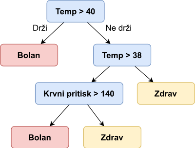
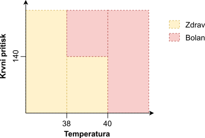
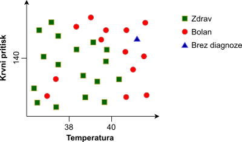
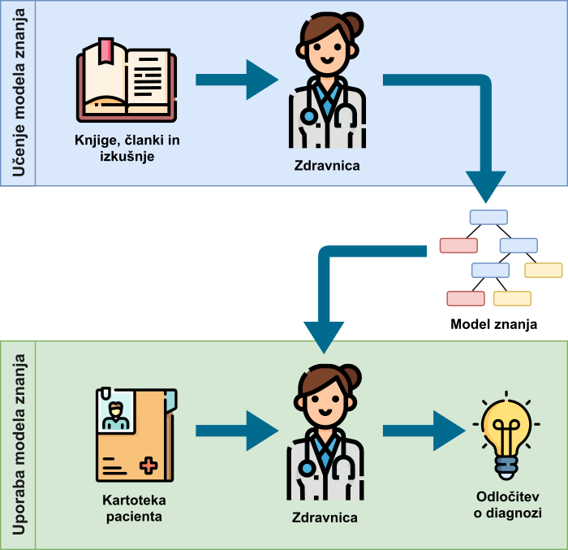
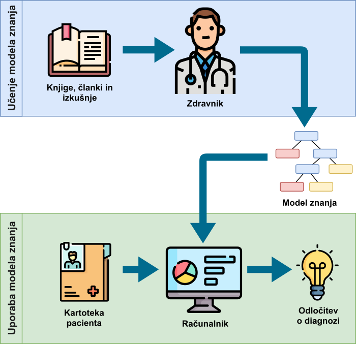
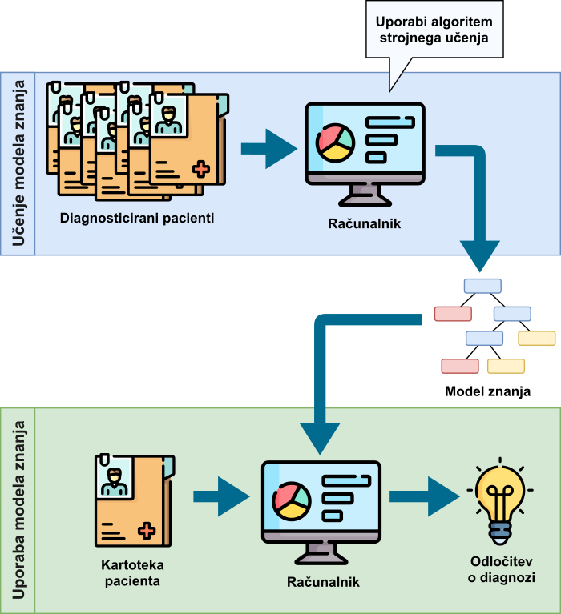

---
tags:
  - Model znanja
  - Ekspertni sistem
  - Algoritem strojnega učenja
  - Inteligentni sistem
  - Podatkovna množica
  - Strojno učenje
---

# Strojno učenje

Kam gremo po nasvet, ko se počutimo bolni? Se zatečemo k sosedu, sodelavki, prijatelju ali pa raje obiščemo zdravnika? Vsekakor je najbolje, da obiščemo zdravnika. Premislimo, zakaj. Kaj je prednost zdravnika v primerjavi z ostalimi naštetimi v danem problemu? Zdravnik ima najverjetneje mnogo več znanja in izkušenj pri diagnozi bolezni, saj se je kot študent več let učil prav o tej tematiki in v svoji delovni karieri že pridobil mnogotero izkušenj. Tekom tega procesa pridobivanja znanja in izkušenj tako predpostavimo, da se je zdravnik že usposobil za kakovostno spopadanje z danim problemom diagnoze bolezni.

## Model znanja

Naslednjič, ko srečate zdravnika, ga kar povprašajte o tem, kako se spopade z izzivom diagnoze pacienta na podlagi simptomov obolenj. Verjetno bo začel s pregledom trenutnega in preteklega stanja pacienta. Naredil bo različne meritve pacientovega telesa (telesna temperatura, krvni pritisk, hormonska slika, krvna slika, rentgen ...) in dodatno pregledal pacientovo kartoteko.

Ob preučevanju novih in preteklih meritev pacienta bo zdravnik najverjetneje že imel ustaljen postopek razmišljanja pri postavitvi diagnoze. Recimo, da želimo analizirati delo našega zdravnika in ga prosimo, da na kar se da razumljiv način opiše svoj proces odločanja. Najverjetneje zdravnik (ali strokovnjak drugih področij) nima formalno določenega procesa odločanja, ampak se pri tem zateka tudi k svoji intuiciji, ki jo je razvil po vseh letih šolanja in izkušenj. Pa vendar, če bi se zdravnik odločil zapisati svoj proces odločanja na papir, bi ta verjetno izgledal nekako tako:

- Če je telesna temperature pacienta nad 40 °C, je pacient **bolan**.
- Če je telesna temperature nad 38 °C in je sistolični krvni pritisk nad 140 mHg, je pacient **bolan**.
- Če je telesna temperature pod 38 °C, je pacient **zdrav**.

Svoj proces diagnoze bi zdravnik zapisal v obliki pravil, katerim bi sledil bodisi po vrsti ali pa bi jih upošteval vse hkrati. Tem pravilom pravimo _model znanja_ (angl. _knowledge model_).

Kateri drug zdravnik pa bi svoj proces odločanja mogoče lažje zapisal v obliki odločitvenega drevesa.

<figure markdown>
  
  <figcaption>Model znanja v obliki odločitvenega drevesa.</figcaption>
</figure>

Pri interpretaciji takega drevesa bi zdravnik začel na vrhu (korenu) drevesa in se z odgovarjanjem na vprašanja v posameznem vozlišču drevesa pri pregledu posameznega pacienta premikal vse do listov drevesa. Listi pa mu povedo odgovor glede diagnoze pacienta.

Nek tretji zdravnik pa boljše razmišlja, ko svoj model znanja predstavi v obliki matematičnih formul. Sledeča slika prikazuje graf, kjer je na horizontalni X osi telesna temperatura pacienta, na vertikalni Y osi pa je krvni pritisk pacienta. Matematična formula deli prostor na dva dela - na prostor, kjer se nahajajo zdravi in na prostor, kjer se nahajajo bolni pacienti.

<figure markdown>
  
  <figcaption>Model znanja v obliki matematične funkcije.</figcaption>
</figure>

Zadnji zdravnik pa bi deloval popolnoma drugače kot prejšnji trije. Ta ne bi znal na papir zapisati svojega modela znanja, saj se odloča po drugačnem postopku - pregleda svoje prejšnje paciente iz bogate dvajsetletne kariere in novega pacienta primerja z njimi. Ko najde primere že diagnosticiranih pacientov, ki so novemu pacientu najbolj podobni, preprosto pogleda, kakšna je bila njihova diagnoza in temu novemu poda mnenje o njegovem stanju bolezni, ki je skladna s prejšnjimi (podobnimi) pacienti. Ta proces je prikazan sledeče.

<figure markdown>
  
  <figcaption>Model znanja v obliki sprotne primerjave z že rešenimi primeri.</figcaption>
</figure>

Vsi štirje opisani načini odločanja zdravnikov v resnici prikazujejo različne načine predstavitve modela znanja. Teh je v realnosti še mnogo več, tekom te knjige pa bomo podrobneje spoznali zadnji način zapisa modela znanja - primerjavo novih primerov s starimi, že rešenimi.

## Ekspertni sistem

Gradnjo modela znanja zdravnika vizualno prikazuje spodnja slika. Najverjetneje preberejo zdravniki tekom študija medicine in delovne kariere mnogo knjig, znanstvenih in strokovnih člankov ter pridobijo mnogotere izkušnje. To kaže zgornji del slike. Rezultat takega procesa je model znanja (seveda ne formalno zapisan). Ob pregledu novega pacienta uporabijo ta model znanja, da pridejo do končne diagnoze pacienta, kar je ponazorjeno s spodnjim delom slike.

<figure markdown>
  {width="500"}
  <figcaption>Poenostavljen prikaz procesa gradnje in uporabe modela znanja.</figcaption>
</figure>

Seveda lahko zdravnikov model znanja prepišemo v programsko kodo in tako uporabimo njegov model znanja v vsakdanjih informacijskih sistemih, kot kaže sledeča slika. To je standardni postopek pri gradnji _ekspertnih sistemov_ (angl. _expert systems_) tj. informacijskih sistemov, ki uporabijo model znanja, ki so jih zgradili strokovnjaki (na primer zdravniki). Z digitalizacijo modela znanja pridobimo zmožnost hitrejše uporabe modela znanja in posledičnega odločanja, saj računalnik lahko tak model znanja uporabi tudi milijonkrat v sekundi.

<figure markdown>
  {width="500"}
  <figcaption>Proces uporabe modela znanja v ekspertnem sistemu.</figcaption>
</figure>

Pri ekspertnem sistemu še vedno ne govorimo o umetni inteligenci ali strojnem učenju, saj računalnik ni sodeloval pri procesu učenja (gradnje modela znanja), ampak je le _neumen_ stroj, ki sledi modelu znanja, zapisanem v obliki _if_ in _for_ stavkov.

## Inteligentni sistem

Premislimo, kako bi lahko v prejšnjem procesu vključili računalnik v proces gradnje modela znanja. Namesto da človek postane strokovnjak s pomočjo preučevanja literature in nabiranja izkušenj, bomo tokrat uporabili kar računalnik za gradnjo modela. Ampak kako? Računalnik ne razume prebranih knjig in ne more pridobivati izkušenj. Tukaj pa uporabimo enak pristop učenja, kot ga uporabijo ljudje v situacijah, kjer se učijo s pomočjo opazovanja - pri delu opazujejo strokovnjake in skušajo ugotoviti, kako strokovnjaki delajo, da lahko to kasneje posnemajo.

Podobno pot uberemo, ko želimo pri gradnji modela uporabiti računalnik kar kaže slika spodaj. Namesto iz knjig in izkušenj, računalnik razbere vzorce iz dela strokovnjakov, ki pa je v tem primeru sestavljeno iz že rešenih problemov. Če računalniku podamo kartoteke že diagnosticiranih pacientov, bo ta lahko iz teh kartotek razbral vzorce, ki so značilni za bolne paciente in vzorce, ki so značilni za zdrave paciente.

Seveda, enako kot vajenec ne bo postal mojster pri enournem opazovanju strokovnjaka pri delu, tako tudi računalnik ne uspe najti vzorcev iz le nekaj primerov že diagnosticiranih pacientov. Koliko podatkov pa bo dovolj? Če je delo mojstra zelo zapleteno, bo vajenec potreboval nekaj let opazovanja, da bo ugotovil pravi način dela tega strokovnjaka. Če pa vajencu kažemo, kako nalepiti obliž na rano, pa bo vajenec vzorec za reprodukcijo videnega odkril že po nekaj minutah. Podobno je tudi pri računalniku.

Količina potrebnih rešenih primerov je odvisna od količine in kompleksnosti vzorcev - več kot je vzorcev in bolj so ti kompleksni, več podatkov bo računalnik potreboval, da bo vzorce prepoznal.

Računalniški algoritem, ki iz podatkov razbira vzorce, imenujemo _algoritem strojnega učenja_ (angl. _machine learning algorithm_). Ta algoritem je zadolžen, da namesto človeka ustvari model znanja, ki ga kasneje lahko pri svojem delu uporabita tako človek, kakor tudi računalnik. Sistem, ki vključuje algoritem strojnega učenja za gradnjo modela znanja, pa imenujemo _inteligentni sistem_ (angl. _intelligent system).

<figure markdown>
  {width="500"}
  <figcaption>Proces učenja in uporabe modela znanja v inteligentnem sistemu.</figcaption>
</figure>

## Podatki

Podatki, uporabljeni v algoritmu strojnega učenja za namen kreacije modela znanja, so združeni v _podatkovne množice_ (angl. _datasets_) in so lahko v obliki preproste strukturirane tekstovne datoteke ali podatkovne baze poljubne strukture (relacijske, objektne ali dokumentne podatkovne baze).

Najenostavnejša struktura podatkov, namenjenih za strojno učenje ima obliko, ki je prikazana v spodnji tabeli. Vsako vrstico v tekstovnem dokumentu ali vsak primerek podatkovne baze imenujemo _učna instanca_ ali _učni primerek_  (angl. _learning example_ ali _learning instance_). Vsaka instanca je opisana z množico karakteristik imenovanih _atributi_ (angl. _features_} ali tudi _neodvisne spremenljivke_ oziroma _značilnice_. Prostor atributov (angl. _feature space_} $F$ je vektor vseh atributov.

<figure markdown>
| Višina | Teža | Starost | … |
|:------:|:----:|:-------:|:-:|
| 181    | 92   | 45      |   |
| 178    | 71   | 27      |   |
| 168    | 73   | 65      |   |
|        | …    |         |   |<figcaption>Atributi so v stolpcih, instance pa so v vrsticah.</figcaption>
</figure>

## Strojno učenje

Strojno učenje (angl. _machine learning_} zajema tehnike, kjer se računalnik nauči reševanja specifičnih in ozko usmerjenih nalog iz podatkov - pravimo, da odločitve strojnega učenja temeljijo na podatkih. Tehnike strojnega učenja uvrščamo v krovno področje _umetne inteligence_ (angl. _artificial intelligence_), ki pa pokriva mnogo širše raziskovalno področje. Področje, povezano s strojnim učenjem, je tako imenovano _podatkovno rudarjenje_ (angl. _data mining_), kjer s pomočjo različnih tehnik, med drugimi tudi s strojnim učenjem, obdelujemo in preučujemo podatke ter poskušamo iz njih razbrati vzorce in posledično novo znanje. Izraz podatkovno rudarjenje uporabljamo, ko se srečamo s problemom uporabe samih metod strojnega učenja kot orodij za reševanje drugih problemov in ne s samo implementacijo teh.

Strojno učenje delimo na štiri področja glede na stopnjo nadzora nad učenjem[^1]:

- **Nadzorovano učenje** (angl. _supervised learning_) se uporablja, ko želimo, da se računalnik nauči klasificirati (razvrščati) podatke v vnaprej določene razrede ali jim pripisovati številske vrednosti. Temu rečemo nadzorovano učenje, ker se stroj uči na rešenih podatkih (z znanimi razredi ali vrednostmi) in ker lahko nadzorujemo kakovost dobljenih modelov znanja. Pri nadzorovanem učenju imamo dve nalogi, ki ju mora stroj opravljati: regresijo in klasifikacijo.
    - **Regresija** (angl. _regression_) se uporablja, ko se računalnik na podlagi podanih karakteristik (neodvisnih spremenljivk) nauči napovedovanja numeričnih vrednosti (odvisne spremenljivke). Primer takega problema bi bil napovedovanje cene delnice ali količine dežja glede na znane podatke. Z regresijo se v tej knjigi ne bomo ukvarjali, zato se v podrobnejše razlage ne bomo spuščali.
    - [**Klasifikacija**](04_klasifikacija.md) (angl. _classification_) pa se uporablja, ko se računalnik iz rešenih podatkov nauči te razvrščati v vnaprej določene razrede. Primer smo že omenjali, ko smo govorili o diagnozi pacientov in ga bomo podrobneje opisali v nadaljevanju.

- **Nenadzorovano učenje** (angl. _unsupervised learning_) uporabimo, ko želimo odkriti še neznane povezave med podatki in strukturo teh podatkov. V tem primeru naši podatki ne vsebujejo rešitve, saj rešitev še ne poznamo, in posledično kakovosti takih modelov ne moremo nadzirati. Nenadzorovano učenje ima več nalog, ki se jih stroj nauči: gručenje in sprememba strukture podatkov.
    - **Gručenje** (angl. _clustering_) je tehnika, kjer računalnik najde vzorce, ki povezujejo podatke v gruče, in tako najde doslej neznane povezave med podatki. Definicija teh gruč ni vnaprej znana, a v vsakem primeru računalnik uporabi eno izmed tehnik, da gruče združujejo podobne in povezane podatke skupaj. Število gruč je lahko vnaprej določeno ali pa se odločitev o številu gruč prepusti računalniku. Primer gručenja je iskanje profilov strank v trgovini, kjer imajo stranke v isti gruči podobne nakupovalne navade.
    - **Spreminjanje in preučevanje strukture podatkov** pa združuje tehnike, ki se ukvarjajo s transformacijo, preslikavo, združevanjem in selekcijo posameznih karakteristik iz podatkov. Podrobneje teh tehnik ne bomo obravnavali v okviru te knjige.

- **Delno nadzorovano učenje** (angl. _semi-supervised learning_) je srednja pot med nadzorovanim in nenadzorovanim učenjem. Pri tej tehniki še vedno klasificiramo podatke v vnaprej podane razrede, pri čemer si pomagamo z novimi karakteristikami podatkov, ki pa so rezultat nenadzorovanega učenja, ali pa uporabljamo le delno označene podatke (na primer, če imamo v učni množici le bolne paciente). Tipična uporaba delno nadzorovanega učenja je iskanje anomalij, kjer poznamo samo lastnosti normalnih podatkov in iz tega sklepamo, kaj je normalno - vse, kar je drugačno, pa je anomalija.
- **Okrepitveno učenje** (angl. _reinforcement learning_) je razširjeno nadzorovano ali nenadzorovano učenje, kjer se računalnik uči na podlagi nagrad ali kazni glede na izide učenja. Pri nagrajevanju in kaznovanju lahko sodeluje človek ali pa je nagrada podeljena računsko. V primeru sodelovanja človeka, ta poda dodatne informacije o samih podatkih, ali pa v iterativnem postopku poda mnenje o kakovosti modela. Tega pristopa strojnega učenja v okviru te knjige ne bomo obravnavali.

[^1]: Jiawei Han, M.K. and Pei, J., 2011. Data mining: concepts and techniques: concepts and techniques.