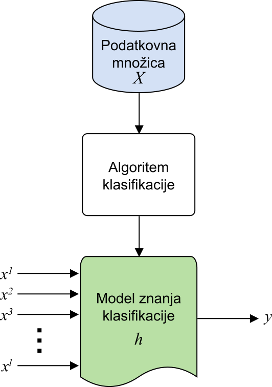

---
tags:
  - Klasifikacija
---

# Klasifikacija

Osrednja metoda strojnega učenja te knjige je metoda _klasifikacije_, kjer se računalnik nauči klasificirati instance v vnaprej določene razrede. Z regresijo napovemo številske vrednosti in so odločitve zvezne, pri klasifikaciji pa napovedujemo nominalne vrednosti - diskretne razrede. Klasifikacija se uporablja v primerih, kot so razpoznava vzorcev na slikah, preprečevanje prevar, zaznavanje nezaželene pošte in diagnosticiranje bolezni. Če računalnik podatke deli v dva razreda, govorimo o _binarni klasifikaciji_, če pa računalnik klasificira v več razredov, pa imamo opravka z _večrazredno klasifikacijo_. [^1]

Obstaja na tisoče različnih algoritmov klasifikacije, ki jih v grobem delimo glede na to, v kakšni obliki shranijo model znanja [^1][^2]:

- matematične formule in porazdelitve (logistična regresija, naivni Bayesov klasifikator, metoda podpornih vektorjev),
- odločitvena drevesa (CART, C4.5, ID3, evolucijska drevesa),
- odločitvena pravila (RIPPER, PART, evolucijska pravila),
- umetne nevronske mreže (konvolucijske, rekurzivne) in
- klasifikatorji na podlagi podobnosti ([_k_ najbližjih sosedov](05_knn.md)).

Nekatere metode zgradijo model znanja, ki se uporablja pri klasifikaciji novih instanc, ne da bi bil potreben vpogled v prej podane podatke. Takim metodam pravimo _metode takojšnjega učenja_ (angl. _eager learning_), saj zgradijo model znanja takoj in ga kasneje ne prilagajajo.

Nasprotno, pa nekatere metode, kot na primer _k_ najbližjih sosedov, ne ustvarijo učnega modela, ampak za vsako klasifikacijo nove instance ponovno naredijo pregled že prej podanih podatkov. Te metode uporabljajo _leno učenje_ (angl. _lazy learning_), saj se učijo sproti po potrebi. Prav ta pristop bomo kasneje pregledali pri preizkusu našega klasifikatorja _k_ najbližjih sosedov.

## Matematična definicija pojmov

V nadaljevanju bomo za metodo klasifikacije uporabljali sledečo definicijo instanc. Ena instanca je par $(x_i,y_i)$, kjer je $x_i$ vektor vrednosti (atributov) te instance, $y_i$ pa je dejanski razred instance (skalarna vrednost). Učna množica $X$ je definirana kot množica vseh instanc, na katerih se algoritem uči, sestavljena je iz $n$ instanc in je definirana, kot prikazuje spodnja enačba.

\begin{align*}
	\begin{split}
		X &= \left\lbrace \left( x_1,y_1 \right),\left( x_2,y_2 \right), \dots ,\left( x_n,y_n \right) \right\rbrace \\
		x_i &= (x_i^1,x_i^2, \dots, x_i^l) \\
		y_i &\in \left\lbrace razred_1, razred_2, \dots , razred_k \right\rbrace  \\
		n &= \text{število instanc} \\
		l &= \text{število atributov} \\
		k &= \text{število razredov}
	\end{split}
\end{align*}

Vrednost $x_i$ je vektor atributov $(x_i^1,x_i^2, \dots, x_i^l)$ velikosti $l$, ki je definiran v prostoru atributov $F$, razred instance $y_i$ pa je vrednost iz nabora vseh možnih razredov v velikosti $k$. Cilj algoritmov klasifikacije je, da ob dani učni množici $X$ najdejo sledečo funkcijo:

\begin{align*}
h: x_i \rightarrow y_i
\end{align*}

za vsak $i \in \left[ 1,n\right]$, tako da bo model znanja klasifikacije $h(x_i)$ dovolj dober napovedovalec razreda $y_i$. Proces klasifikacije prikazuje sledeča slika, kjer iz podatkovne množice $X$ algoritem klasifikacije ustvari model znanja klasifikacije $h$. Ta model preslika vhode instance $x^1, x^2, \dots, x^l$ v razred $y$..

<figure markdown>
  {width="300"}
  <figcaption>Splošni proces klasifikacije.</figcaption>
</figure>

Ob pregledu splošnega področja strojnega učenja in klasifikacije pa zdaj sledi preizkus prvega klasifikatorja. Naredili bomo teoretični pregled klasifikatorja _k_ najbližjih sosedov in prikazali praktični primer njegove uporabe.

[^1]: Friedman, J., Hastie, T. and Tibshirani, R., 2001. The elements of statistical learning (Vol. 1, No. 10). New York: Springer series in statistics.
[^2]: Kotsiantis, S.B., Zaharakis, I. and Pintelas, P., 2007. Supervised machine learning: A review of classification techniques. Emerging artificial intelligence applications in computer engineering, 160(1), pp.3-24.