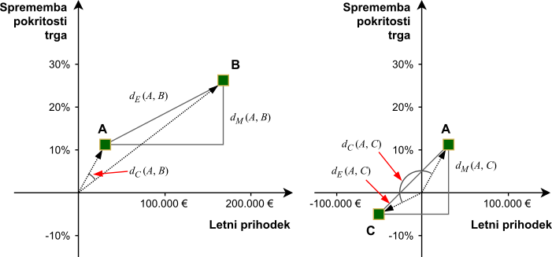

---
tags:
  - k najbližjih sosedov
---

# K najbližjih sosedov

Začeli bomo s pregledom delovanja klasifikacije na podlagi podobnosti med instancami. Prvo vprašanje, ki se nam poraja, je, kako sploh določimo podobnost med instancami? Oziroma povedano drugače, kdaj sta si dve instanci podobni in kdaj ne? Intuitivno si ljudje naredimo prvi vtis glede na podobnost z že poznanimi koncepti. Vidimo nov avto? Ta je podoben našemu avtu doma - torej je najverjetneje hiter, porabi veliko goriva in ni primeren za vožnjo po slabi cesti.

<figure markdown>
  
  <figcaption>Izbira novih čevljev s primerjavo.</figcaption>
</figure>

Kaj pa, če izbiramo nove zimske čevlje izmed nabora čevljev, ki jih trgovina ponuja? Vse čevlje v ponudbi primerjamo na podlagi izkušenj z zimskimi čevlji, ki smo si jih lastili v preteklosti. Želimo si nove čevlje, ki so čim bolj podobni prejšnjim, na žalost obrabljenim. Všeč nam je bila njihova barva, prav tako nas niso žulili pri daljši hoji, na ledu nam nikoli ni drselo pa tudi za na fakulteto so bili primerni. Izmed vseh ponujenih čevljev najdemo najbližje našim prejšnjim - to ljudje naredimo intuitivno, hitro in brez nepotrebnih kalkulacij.

Kako pa pripravimo računalnik, da bo videl podobnosti med predstavljenimi koncepti? Z izračunom razdalje med dvema konceptoma. Bolj sta si dve stvari podobni, manjša je razdalja med njima, ter obratno - manj sta si dve stvari podobni, večja je razdalja med njima.

## Računanje razdalj

Poglejmo si primer primerjave dveh čevljev.

<figure markdown>
  
  <figcaption>Primerjava dveh čevljev.</figcaption>
</figure>

Ta primer preslikajmo v tabelo, kjer je prva vrstica namenjena atributom prvih čevljev, druga vrstica je namenjena atributom drugih čevljev, v tretji vrstici pa so razlike med njima.

<figure markdown>
|          | Višina | Teža | Vodoodporni | Barva |
|:---------|:--------:|:------:|:-------------:|:-------:|
| Čevlji A | 17       | 231    | da            | rjavi   |
| Čevlji B | 9        | 119    | ne            | modri   |
| Razlika  | 8        | 112    | ?             | ?       |
<figcaption>Primer računanja razdalje med dvema čevljema.</figcaption>
</figure>

Razlike med številskimi atributi je enostavno izračunati; preprosto vzamemo vrednost številskih atributov prve instance in odštejemo vrednost atributov druge instance. V primeru kategoričnih atributov pa ni možno določiti, kateri kategoriji sta si bližji in kateri sta si dlje. Ko moramo izračunati razdaljo med dvema kategorijama, preprosto uporabimo naslednje pravilo:

- Če sta kategoriji enaki, je razdalja med njima 0.
- Če sta kategoriji različni, je razdalja med njima 1.

Knjižnica `scikit-learn` pa ne razlikuje med tipi spremenljivk - vse spremenljivke obravnava kot številske oziroma razmernostne. Za naši dve kategorični spremenljivki vodoodpornosti in barve čevljev to predstavlja težavo, saj v trenutni obliki nista zapisani v obliki števil.

#### Indikacijski atributi

Za uporabo podatkov s knjižnico `scikit-learn` je podatke potrebno prilagoditi tako, da kategorične atribute spremenimo v številske.

Napačen pristop bi bil določitev števila vsaki kategoriji. Pri barvi čevljev bi tako barva _črna_ postala število 0, barva _modra_ število 1, _barva_ rjava število 2, in tako naprej. Ta pristop še vedno ni pravilen, saj algoritmi strojnega učenja največkrat operirajo s takimi vrednostmi - naključna določitev številk kategorijam pa bi izračune pokvarila. Pri računanju razdalj bi tako razdalja med črnimi in rjavimi čevlji bila 2, med črnimi in modrimi pa le 1. To je nesmiselno, saj barv ne moremo postaviti v vrstni red.

Posledično se transformacije kategoričnih atributov v številske atribute lotimo s pomočjo kreacije _indikacijskih atributov_ (angl. _dummy attribute_). Iz enega kategoričnega atributa tako nastane več novih številskih atributov. Za vsako kategorijo enega kategoričnega atributa tako nastane svoj številski atribut. Če so čevlji lahko treh različnih barv (črni, modri, rjavi), potem nastanejo trije novi atributi: _Barva (črni)_, _Barva (modri)_ in _Barva (rjavi)_. Indikacijski atribut ima lahko le dve vrednosti:

- vrednost 0, če kategorija **ne drži** za instanco ter
- vrednost 1, če kategorija **drži** za instanco.

Poglejmo si tabelo podatkov obeh čevljev po transformaciji kategoričnih atributov v indikacijske atribute. Zdaj je primerjava mnogo bolj smiselna. Prav tako je opazno, da obstaja razlika tako v vodoodpornosti čevljev, kakor v barvi.

<figure markdown>
|          | Višina | Teža | Vod. | Vod. | Barva  | Barva   | Barva   |
|:---------|:--------:|:------:|-------:|-------:|---------:|----------:|----------:|
|          |          |        | _(da)_ | _(ne)_ | _(modri)_| _(rjavi)_ | _(črni)_  |
| Čevlji A | 17       | 231    | 1      | 0      | 0        | 0         | 1         |
| Čevlji B | 9        | 119    | 0      | 1      | 0        | 1         | 0         |
| Razlika  | 8        | 112    | 1      | -1     | 0        | -1        | 1         |
<figcaption>Primer računanja razdalje z indikacijskimi atributi.</figcaption>
</figure>

### Kreacija indikacijskih atributov v Pythonu

Najenostavnejši postopek kreacije indikacijskih atributov je s pomočjo `pandas` knjižnice. Struktura podatkov `DataFrame` ima že zabeležen tip vsakega stolpca, kar poenostavi avtomatsko transformacijo kategoričnih atributov v indikacijske. Sledeča koda prikazuje kreacijo podatkov, iz katerih se bodo kreirali indikacijski atributi.

```py
import pandas as pd

cevljiA = [17, 231, 'da', 'rjavi']
cevljiB = [9, 119, 'ne', 'modri']
cevljiC = [12, 143, 'ne', 'črni']
cevljiD = [8, 112, 'ne', 'rjavi']
cevljiE = [11, 198, 'da', 'modri']
cevljiF = [15, 245, 'da', 'črni']

# Z združitvijo instanc ustvarimo DataFrame
podatki = pd.DataFrame([cevljiA, cevljiB, cevljiC,
                        cevljiD, cevljiE, cevljiF],
                       columns=['Višina', 'Teža', 
                                'Vodood', 'Barva'],
                       index=['cevlji A', 'cevlji B', 
                              'cevlji C', 'cevlji D', 
                              'cevlji E', 'cevlji F'])

print(podatki)
```
<div class="result" markdown>
```
          Višina  Teža  Vodood  Barva
cevlji A  17      231   da      rjavi
cevlji B  9       119   ne      modri
cevlji C  12      143   ne      črni
cevlji D  8       112   ne      rjavi
cevlji E  11      198   da      modri
cevlji F  15      245   da      črni
```
</div>

S pregledom vrednosti `dtypes` podatkov lahko ugotovimo kakšnega tipa je posamezen atribut (stolpec).

```py
podatki.dtypes
```
<div class="result" markdown>
```
Višina  int64
Teža    int64
Vodood  object
Barva   object
dtype:  object
```
</div>

Atributa `Vodood` in `Barva` sta tipa `object`, kar pomeni, da sta obravnavana kot kategorični spremenljivki. Pred uporabo teh podatkov v procesu strojnega učenja s knjižnico `scikit-learn` je potrebno spremeniti vse atribute `object` v številske. Knjižnica `pandas` ponuja metodo `get_dummies()`, ki pregleda podane podatke tipa `DataFrame` in vse atribute tipa `object` spremeni v indikacijske atribute. Izvorna spremenljivka se ne spremeni, temveč se podatki z indikacijskimi atributi vrnejo kot rezultat metode.

Pregled tipa atributov pokaže, da so zdaj vsi atributi številskega tipa, s čimer zadostimo uporabi v kombinaciji s `scikit-learn` knjižnico.

```py
# Vse kategorične (object) atribute spremenimo v indikacijske
podatki_z_indikacijskimi = pd.get_dummies(podatki)

podatki_z_indikacijskimi.dtypes
```
<div class="result" markdown>
```
Višina       int64
Teža         int64
Vodood_da    uint8
Vodood_ne    uint8
Barva_modri  uint8
Barva_rjavi  uint8
Barva_črni   uint8
dtype:       object
```
</div>

Pregled vsebine novih podatkov prikaže novonastale indikacijske atribute.

```py
print(podatki_z_indikacijskimi)
```
<div class="result" markdown>
```
          Višina  Teža  Vodood_da  Vodovod_ne Barva_modri  Barva_rjavi  Barva_črni
cevlji A  17      231   1          0          0            1            0
cevlji B  9       119   0          1          1            0            0
cevlji C  12      143   0          1          0            0            1
cevlji D  8       112   0          1          0            1            0
cevlji E  11      198   1          0          1            0            0
cevlji F  15      245   1          0          0            0            1
```
</div>

## Skupna razdalja

Pri vmesnih izračunih razdalj še vedno ne pridemo do končne skupne razdalje med dvema instancama. Za agregacijo vmesnih razdalj v eno mero razdalje pa lahko izberemo več različnih pristopov. Sledeča slika prikazuje več vrst razdalj, ki bodo opisane v sledečih sekcijah.

<figure markdown>
  
  <figcaption>Različne razdalje med dvema točkama.</figcaption>
</figure>


### Evklidska razdalja

Evklidsko razdaljo med dvema točkama v ravnini je definiral matematik Evklid. Deluje po principu Pitagorovega izreka, kjer se razdalja med dvema točkama oz. instancama ($x_1$ in $x_2$) izračuna kot koren vsote kvadratov vseh dimenzij.

\begin{align*}
    \begin{split}
         d_E\left(x_1,x_2\right)&=\sqrt{\left( x_1^{(1)}-x_2^{(1)}\right)^2 + \left( x_1^{(2)}-x_2^{(2)}\right)^2 + \dots \left( x_1^{(l)}-x_2^{(l)}\right)^2} 
        \\
         &=\sqrt{\sum \nolimits _{i=1}^{l}  \left( x_1^{(i)}-x_2^{(i)}\right)^2 } 
    \end{split}
\end{align*}

kjer je $l$ število atributov posamezne instance.

### Mahattanska razdalja

Zelo pogosto pa nas zanima manhattanska razdalja, ki si zgled za računanje razdalje med dvema točkama vzame po postavitvi cest na otoku Manhattan, kot kaže slika spodaj. V večjem delu otoka so ceste postavljene vzdolž otoka (avenije) in prečno po otoku (ulice). Pri računanju razdalje od ene točke do druge je tako potrebno v obzir vzeti dolžine vseh cest med dvema točkama, pri tem pa ni možno krajšati poti z diagonalami.

<figure markdown>
  
  <figcaption>Razdalje na Manhattnu.</figcaption>
</figure>

Pri izračunu manhattanske razdalje tako ni najkrajša pot predstavljena kot diagonalna in najkrajša daljica med dvema instancama, ampak kot vsota vseh daljic, ki poteka vzdolž vseh osi. 

\begin{align*}
    \begin{split}
         d_M\left(x_1,x_2\right)&=\left| x_1^{(1)}-x_2^{(1)}\right| + \left| x_1^{(2)}-x_2^{(2)}\right| + \dots \left| x_1^{(l)}-x_2^{(l)}\right| 
    \\
         &=\sum \nolimits _{i=1}^{l}  \left| x_1^{(i)}-x_2^{(i)}\right|
    \end{split}
\end{align*}

### Kosinusna razdalja

Z manhattansko in evklidsko razdaljo pa pridemo do težav, ko imamo meritve, ki lahko imajo tako negativne kot pozitivne vrednosti. Primer take meritve bi bil letni zaslužek podjetja, saj je ta lahko tudi negativen (podjetje je na letni ravni imelo izgubo). Za primer vzemimo tri podjetja in njihove letne zaslužke ter spremembe deleža pokritega trga od prejšnjega leta, kot je na sliki.

<figure markdown>
  
  <figcaption>Primerjava evklidske, manhattanske in kosinusne razdalje.</figcaption>
</figure>

Tako evklidska kakor tudi manhattanska razdalja pravita, da sta podjetji A in C bližje kot pa podjetji A in B.

\begin{align*}
    \begin{split}
        d_E\left(A,B\right)&>d_E\left(A,C\right)\\
        d_M\left(A,B\right)&>d_M\left(A,C\right)\\
        d_C\left(A,B\right)&<d_M\left(A,C\right)
    \end{split}
\end{align*}

To je v nasprotju z našo intuicijo: podjetje C je namreč imelo izgubo v letnem prihodku in negativno spremembo pokritosti trga. Podjetji A in B pa sta imeli tako dobiček, kakor tudi se je njun delež pokritega trga povečal v primerjavi z lanskim letom.

V takih situacijah sta evklidska in manhattanska razdalja neprimerni ter se uporabi kosinusna razdalja. Pri kosinusni razdalji je pomembna (1) smer vektorja posamezne instance ter (2) njegova dolžina. Razliko med smerjo dveh vektorjev merimo s kotom $\alpha$ med vektorjema (instancama), ta pa je proporcionalna kosinusu kotov. Za instanci $x_1$ in $x_2$ velja sledeč izračun kosinusne razdalje.

\begin{align*}
    \begin{split}
         d_C\left(x_1,x_2\right)&=1- \frac { x_1 \cdot x_2}{||x_1|| \cdot ||x_2||}
    \\
         &=1-\frac { \sum _{i=1}^{l} x_1^{(i)} *  x_2^{(i)}}{\sqrt{\sum _{i=1}^{l} x_1^{i~2}} * \sqrt{\sum _{i=1}^{l} x_2^{i~2}}}
    \end{split}
\end{align*}

Izbira načina izračuna razdalje je odvisna od problema. Najbolj intuitivna je vsekakor evklidska razdalja. Večji je nabor atributov $l$, bolj je primerna manhattanska razdalja v primerjavi z evklidsko [^1]. Kosinusna razdalja pa je primerna, ko nas bolj kot razdalje zanimajo podobnosti med instancami.

## Klasifikator _k_ najbližjih sosedov

Pri nekaterih algoritmih klasifikacije ne nastane učni model, ampak se klasifikator odloča vsakokrat ob pogledu v že klasificirane instance. Taka vrsta učenja se imenuje _leno učenje_ in algoritem klasifikacije _k_ najbližjih sosedov (angl. _k nearest neighbors_) je tipični primer _lenega_ algoritma učenja. Sledi pregled delovanja tega algoritma _k_ najbližjih sosedov.

### Delovanje _k_ najbližjih sosedov

Algoritem _k_ najbližjih sosedov steče po sledečem postopku [^2]^,^[^3].

- Za podano instanco $x_N$, ki jo želimo klasificirati, algoritem izračuna razdalje do vseh že klasificiranih instanc.
- Že klasificirane instance razvrsti naraščajoče glede na razdaljo do instance $x_N$.
- V nadaljnji obravnavi upošteva le $k$ prvih instanc v naraščajočem seznamu - $k$ najbližjih sosedov.
- Izračuna pogostosti razredov iz nabora $k$ najbližjih instanc kot je na sliki spodaj.
- Najpogostejši razred (modus) vrne kot rezultat klasifikacije instance $x_N$. Če se več razredov pojavlja z največjo pogostostjo, se izbere naključen razred izmed vseh najpogostejših.


<figure markdown>
  
  <figcaption>Klasifikacija instance (moder trikotnik) s pomočjo k najbližjih sosedov ob različnih nastavitvah parametra k. Pri računanju razdalj je uporabljena evklidska razdalja.</figcaption>
</figure>

<figure markdown>
| Sist. krvni tlak | Tel. temp. | Bolan | Evklidska |   | Manhattanska   |    |
|:----------------:|:----------:|------:|----------:|------:|----------:|----------:|
|    _(mmHg)_      |   _(°C)_   |       | _d_       | _rang_| _d_ | _rang_  |
|82 | 38,0 | Da | 28,0 | 17 | 28,7 | 17 |
|85 | 36,4 | Da | 25,1 | 16 | 27,3 | 16 |
|89 | 36,7 | Da | 21,1 | 14 | 23,0 | 14 |
|94 | 38,2 | Da | 16,0 | 11 | 16,5 | 11 |
|95 | 38,2 | Da | 15,0 | 9 | 15,5 | 9 |
|95 | 37,6 | Ne | 15,0 | 10 | 16,1 | 10 |
|100 | 36,6 | Ne | 10,2 | 7 | 12,1 | 7 |
|104 | 35,5 | Ne | 6,8 | 5 | 9,2 | 6 |
|108 | 35,7 | Ne | 3,6 | 3 | 5,0 | 3 |
|108 | 38,4 | Da | 2,0 | 2 | 2,3 | 2 |
|109 | 39,4 | Da | 1,2 | 1 | 1,7 | 1 |
|113 | 36,4 | Ne | 3,8 | 4 | 5,3 | 4 |
|119 | 38,7 | Da | 9,0 | 6 | 9,0 | 5 |
|124 | 37,5 | Ne | 14,1 | 8 | 15,2 | 8 |
|128 | 37,8 | Ne | 18,0 | 12 | 18,9 | 12 |
|129 | 38,8 | Da | 19,0 | 13 | 19,1 | 13 |
|135 | 39,4 | Da | 25,0 | 15 | 25,7 | 15 |
|140 | 36,6 | Ne | 30,1 | 18 | 32,1 | 18 |
|145 | 36,0 | Da | 35,1 | 19 | 37,7 | 19 |
|147 | 36,5 | Da | 37,1 | 20 | 39,2 | 20 | 
<figcaption>Učne instance.</figcaption>
</figure>

<figure markdown>
| Sist. krvni tlak | Tel. temp. | Bolan |
|:----------------:|:----------:|------:|
|    _(mmHg)_      |   _(°C)_   |       |
|110| 38,7 | ? |
<figcaption>Nova instanca.</figcaption>
</figure>

#### Primer klasifikacije pacientov

Sledi primer izračunov algoritma _k_ najbližjih sosedov po korakih na primeru diagnoze bolezni pacientov. Imamo učno množico, kjer merimo sistolični krvni tlak pacientov in njihovo telesno temperaturo. Med kartotekami imamo že zabeležene podatke 20 prejšnjih pacientov in njihove diagnoze, ki so jih postavili zdravniki. Instance in nov pacient so prikazani v zgornji tabeli.

V tabeli je prav tako podan izračun razdalj, evklidske in manhattanske. Izračun obeh razdalj med prvo instanco množice in novo instanco pacienta poteka po sledečem postopku.

\begin{align*}
    \begin{split}
         d_E\left(x_N,x_1\right)&=\sqrt{\left( 110-82\right)^2 + \left( 38,7 - 38,0\right)^2}\\
         &=\sqrt{\left(28\right)^2 + \left(0,7\right)^2}\\
         &=\sqrt{784 + 0,49} =\sqrt{784,49} = 28,0 \\
         \\
         d_M\left(x_N,x_1\right)&=\left| 110-82\right| + \left| 38,7 - 38,0\right|\\
         &=\left| 28\right| + \left| 0,7\right|\\
         &=28 + 0,7 =28,7
    \end{split}
\end{align*}

Razvidno je, da razlika v krvnem tlaku prevladuje pri izračunu razdalje. Do tega pride zaradi različnih enot, posledica pa je, da razdalje atributov z večjimi številskimi vrednostmi prevladujejo nad atributi manjših številskih vrednosti. Če želimo prispevek atributov pri računanju skupne razdalje poenotiti, se je potrebno lotiti standardizacije podatkov, s čimer postavimo vse meritve na enako zalogo vrednosti.

### Standardizacija podatkov

_Standardizacija_ (angl. _standardization_) je postopek transformacije podatkov na tak način, da bodo ti po transformaciji imeli povprečje enako 0 in standardni odklon enak 1. Za standardizacijo podatkov $x$ rabimo njihovo povprečje $\mu$ in standardni odklon $\rho$, ki je definiran sledeče za vseh $n$ instanc.

\begin{align*}
    \begin{split}
         {\rho} &= \sqrt{\frac{(x_1-\mu)^2+(x_1-\mu)^2+\dots+(x_n-\mu)^2}{n}}
    \end{split}
\end{align*}

Standardizirane vrednosti $z$ izračunamo iz izvornih podatkov $x$ sledeče.

\begin{align*}
    \begin{split}
         z &= \frac{x-\mu}{\rho}
    \end{split}
\end{align*}

Vsak atribut $x^1$, $x^2$, $\dots$, $x^l$ standardiziramo ločeno - transformirano z njegovim povprečjem in standardnim odklonom. Po standardizaciji vseh atributov (tudi indikacijskih) imajo vsi atributi povprečje v vrednosti 0 in standardni odklon 1. Razdalje posameznih atributov med instancami bodo tako v podobnem intervalu.

Za standardizacijo podatkov pacientov tako potrebujemo podatke povprečja in standardnega odklona instanc, kar prikazuje spodnja enačba. 

\begin{align*}
    \begin{split}
         \mu\left(\text{Sistolični krvni pritisk}\right)&= 112,45\\
         \rho\left(\text{Sistolični krvni pritisk}\right)&= 19,58\\
         \mu\left(\text{Telesna temperatura}\right)&= 37,42\\
         \rho\left(\text{Telesna temperatura}\right)&= 1,17\\
    \end{split}
\end{align*}

Tabela prikazuje vrednosti atributov po standardizaciji.

<figure markdown>
| Sist. krvni tlak | Tel. temp. | Bolan | Evklidska |   | Manhattanska   |    |
|:----------------:|:----------:|------:|----------:|------:|----------:|----------:|
|    _(mmHg)_      |   _(°C)_   |       | _d_       | _rang_| _d_ | _rang_  |
|-1,55 | 0,49 | Da | 1,55 | 11 | 2,03 | 11 |
|-1,40 | -0,87 | Da | 2,34 | 15 | 3,24 | 17 |
|-1,20 | -0,61 | Da | 2,01 | 14 | 2,78 | 15 |
|-0,94 | 0,66 | Da | 0,92 | 5 | 1,24 | 6 |
|-0,89 | 0,66 | Da | 0,88 | 4 | 1,19 | 5 |
|-0,89 | 0,15 | Ne | 1,21 | 8 | 1,70 | 8 |
|-0,64 | -0,70 | Ne | 1,86 | 12 | 2,30 | 13 |
|-0,43 | -1,64 | Ne | 2,74 | 19 | 3,03 | 16 |
|-0,23 | -1,47 | Ne | 2,56 | 17 | 2,66 | 14 |
|-0,23 | 0,84 | Da | 0,28 | 1 | 0,36 | 1 |
|-0,18 | 1,69 | Da | 0,60 | 3 | 0,65 | 3 |
|==0,03== | ==-0,87== | ==Ne== | ==1,97== | ==13== | ==2,11== | ==12== |
|0,33 | 1,09 | Da | 0,46 | 2 | 0,46 | 2 |
|0,59 | 0,07 | Ne | 1,25 | 9 | 1,74 | 9 |
|0,79 | 0,32 | Ne | 1,20 | 7 | 1,69 | 7 |
|0,85 | 1,18 | Da | 0,97 | 6 | 1,06 | 4 |
|1,15 | 1,69 | Da | 1,41 | 10 | 1,87 | 10 |
|1,41 | -0,70 | Ne | 2,36 | 16 | 3,32 | 18 |
|1,66 | -1,21 | Da | 2,91 | 20 | 4,09 | 20 |
|1,76 | -0,78 | Da | 2,66 | 18 | 3,76 | 19 |
<figcaption>Standardizirane učne instance.</figcaption>
</figure>

<figure markdown>
| Sist. krvni tlak | Tel. temp. | Bolan |
|:----------------:|:----------:|------:|
|    _(mmHg)_      |   _(°C)_   |       |
|-0,13| 1,09 | ? |
<figcaption>Standardizirana nova instanca.</figcaption>
</figure>

Podatki po standardizaciji kažejo drugačno sliko. Vrstni red najbližjih instanc podani instanci se spremeni.

Instanca, ki je v tabeli označena, je pred standardizacijo bila četrta najbližja podani instanci. Pred standardizacijo je namreč bila razlika v temperaturi majhna v primerjavi z razliko v krvnem tlaku. Po standardizaciji pa je razlika v temperaturi mnogo večja, kot razlika pri krvnem tlaku. To je prav, saj sta bili pred standardizacijo zalogi vrednosti obeh meritev drugačni. Realni obseg telesne temperature človeka je približno med 35 in 41 °C, kar predstavlja maksimalno razliko 6 enot. Šest enot razlike pri krvnem tlaku pa ni niti približno realnemu obsegu sistoličnega krvnega tlaka, ki se lahko giblje v intervalu med 80 in 180 mmHg z maksimalno razliko kar 100 enot. Po standardizaciji se krvni tlak giblje med $-1,55$ ter $1,76$ z maksimalno razliko $3,31$. To je v skladu z obsegom telesne temperature, ki se po standardizaciji giblje med $-1,64$ ter $1,69$ z maksimalno razliko $3,33$.

Standardizacija je le en postopek tehnike, ki jo imenujemo _normalizacija podatkov_. Alternative standardizaciji so _min-max skaliranje_, _centriranje_, _rangiranje_ in drugi. Vsak pristop strojnega učenja ni občutljiv na intervale oz. skalo atributov. Med take štejemo algoritme kreacije odločitvenih dreves in naivnega Bayesa. Dobra praksa je, da pri postopku podatkovnega rudarjenja podatke pred obdelavo vedno normaliziramo, saj se s tem izognemo morebitnemu zavajanju algoritmov.

Negativna plat normalizacije podatkov pa je, da ti niso največkrat enostavno interpretabilni. Kakor kažejo standardizirane vrednosti v zgornji tabeli, so vrednosti telesne temperature nesmiselne. To postane še posebej problematično v primeru, ko gradimo model znanja, ki temelji na pravilih (odločitvena pravila ali odločitvena drevesa), saj bodo vrednosti v pravilih standardizirane.

#### Standardizacija v Pythonu

Sledi primer, kjer za začetek najprej pregledamo povprečne vrednosti in standardne odklone atributov pred standardizacijo.

```py
from sklearn.datasets import load_iris

# Naložimo podatke
podatki = load_iris(as_frame=True)

print('Povprečja pred standardizacijo:')
print(podatki.data.mean(axis=0))
print('Standardni odkloni pred standardizacijo:')
print(podatki.data.std(axis=0))
```
<div class="result" markdown>
```
Povprečja pred standardizacijo:
sepal length (cm)    5.843333
sepal width (cm)     3.057333
petal length (cm)    3.758000
petal width (cm)     1.199333
dtype: float64
Standardni odkloni pred standardizacijo:
sepal length (cm)    0.828066
sepal width (cm)     0.435866
petal length (cm)    1.765298
petal width (cm)     0.762238
dtype: float64
```
</div>

Sedaj pa te podatke standardiziramo in izpišemo povprečja ter standardne odklone novih vrednosti. Knjižnica `scikit-learn` ponuja kar nekaj načinov transformacije podatkov. Za standardizacijo se uporablja razred `StandardScaler`. S klicem metode `fit` se izračunata povprečje in standardni odklon iz podanih podatkov. Za transformacijo podatkov, pa se uporabi klic metode `transform`, kateri podamo podatke, ki jih želimo transformirati.

```py
from sklearn.preprocessing import StandardScaler

# Inicializacija standardizatorja
std = StandardScaler()

# Izračunamo povprečja in standardne odklone atributov
std.fit(podatki.data)

# Standardizacija podatkov
stand_podatki = std.transform(podatki.data)

print('Povprečja po standardizaciji:')
print(stand_podatki.mean(axis=0))
print('Standardni odkloni po standardizaciji:')
print(stand_podatki.std(axis=0))
```
<div class="result" markdown>
```
ovprečja po standardizaciji:
-4.73695157e-16 -7.81597009e-16 -4.26325641e-16 -4.73695157e-16
Standardni odkloni po standardizaciji:
1. 1. 1. 1.
```
</div>

Pregled rezultatov povprečij kaže, da so te zelo blizu vrednosti 0 ($10^{-15}$), standardni odkloni pa so enaki 1. Če želimo proces izračuna povprečij in standardnih odklonov ter proces transformacije podatkov združiti, lahko uporabimo metodo `fit_transform`, ki na podanih podatkih izračuna vmesne vrednosti in jih vrne transformirane.

```py
stand_podatki = std.fit_transform(podatki.data)
```

### Določitev razreda podane instance

Po izračunu razdalj in določitvi rangov glede na bližino do nove instance sledi določitev razreda (klasifikacija) nove instance. Pri tem procesu igra pomembno vlogo določitev vrednosti parametra $k$, ki nam pove, koliko najbližjih instanc upoštevamo pri klasifikaciji. Vseh $k$ najbližjih instanc bo namreč glasovalo za razred nove instance - vsaka instanca bo dala glas za razred, kateremu le-ta pripada.

Če je parameter $k=1$, potem vzamemo le najbližjo instanco in bo novi instanci dodeljen razred te instance. Če se navežemo na primer iz tabele zgoraj, je pri izračunu obeh razdalj najbližja ista instanca - ta je razreda _Da_ kar pomeni, da tudi novo instanco klasificiramo v razred _Da_. Tabeli spodaj prikazujeta rezultate klasifikacije pri različnih nastavitvah - pri standardiziranih in nestandardiziranih podatkih, pri različnih vrednostih $k$ in pri evklidski ter manhattanski razdalji.

<figure markdown>
|    |  |Evklidska|    |  |Manhattanska|    |
|:--:|:---------:|:--:|:--:|:------------:|:--:|:--:|
|_k_ |_Da_|_Ne_|_Rezultat_|_Da_|_Ne_|_Rezultat_|
| 2  | 2  | 0  | Da | 2 | 0 | Da |
| 3  | 2  | 1  | Da | 2 | 1 | Da |
| 4  | 2  | 2  | Da/Ne | 2 | 2 | Da/Ne |
| 5  | 2  | 3  | Ne | 3 | 2 | Da |
<figcaption>Klasifikacija s k najbližjih sosedov pri različnih nastavitvah na nestandardiziranih podatkih.</figcaption>
</figure>

<figure markdown>
|    |  |Evklidska|    |  |Manhattanska|    |
|:--:|:---------:|:--:|:--:|:------------:|:--:|:--:|
|_k_ |_Da_|_Ne_|_Rezultat_|_Da_|_Ne_|_Rezultat_|
| 2 | 2 | 0 | Da | 2 | 0 | Da |
| 3 | 3 | 0 | Da | 3 | 0 | Da |
| 4 | 4 | 0 | Da | 4 | 0 | Da |
| 5 | 5 | 0 | Da | 5 | 0 | Da |
<figcaption>Klasifikacija s k najbližjih sosedov pri različnih nastavitvah na standardiziranih podatkih.</figcaption>
</figure>

Zgornja tabela kaže zanimive rezultate. Najprej poglejmo nestandardizirane podatke. Tako pri evklidski, kot tudi pri manhattanski razdalji, se z večanjem števila najbližjih instanc, ki se upoštevajo pri klasifikaciji, veča tudi negotovost, saj iz razreda _Da_ pri upoštevanju le ene najbližje instance ($k=1$) preidemo do negotovosti, ko upoštevamo štiri najbližje instance ($k=4$), pa vse do spremembe odločitve v razred _Ne_, ko upoštevamo pet najbližjih instanc ($k=5$) pri evklidski razdalji. Ti rezultati nam kažejo tudi razliko med evklidsko in manhattansko razdaljo, saj se odločitve končnega razreda instance ne skladajo pri $k=5$. Hkrati pa se moramo soočiti še z negotovostjo pri $k=4$. Ko pridemo do neodločenega izida, se algoritem odloči za en naključen razred v vodstvu (tisti, ki ima manjši indeks), kar pa ni vedno najboljša odločitev. Če bi ročno želeli izničiti možnosti za neodločene izide in naključne odločitve med njimi, bi algoritem preprosto zagnali še na drugih nastavitvah vrednosti $k$ in pogledali, kakšen je končen razred tedaj. Ko imamo opravek z binarno klasifikacijo (delitev instanc v dva razreda), pa se neodločenih izidov lahko znebimo z liho vrednostjo $k$.

Po drugi strani pa ob pregledu rezultatov po standardizaciji vidimo večjo stabilnost, saj obstaja konsenz pri vseh nastavitvah $k$ in pri obeh tipih razdalje. Ta pristop se tako izkaže kot bolj robusten na manjše spremembe, pa tudi konceptualno je primernejši, saj vsi atributi instanc enakovredno vplivajo na odločitev klasifikacije.

## Uporaba _k_ najbližjih sosedov v Pythonu

Algoritem _k_ najbližjih sosedov je v knjižnici `scikit-learn` implementiran z razredom `KNeighborsClassifier`. Že pri inicializaciji primerka tega razreda določimo $k$ število najbližjih sosedov s parametrom `n_neighbors` in način računanja razdalje s parametrom `metric`.

```py
from sklearn.neighbors import KNeighborsClassifier

klasif = KNeighborsClassifier(n_neighbors=3,
                              metric='manhattan')

klasif.fit(X_u, y_u)
napovedi = klasif.predict(X_t)
```

Pri računanju razdalje lahko uporabimo evklidsko razdaljo z `euclidean`, mahattansko z `manhattan` in kosinusno razdaljo s `cosine`. S klicem metode `fit` in podajo podatkov instanc `X_u` in njihovih razredov `y_u` te shranimo in bodo služili za izračun najbližjih sosedov. Metodo `predict` pa kličemo s podajo množice instanc `X_t`, ki jih želimo klasificirati.

To je tudi standardni postopek uporabe drugih algoritmov klasifikacije, regresije in gručenja v knjižnici `scikit-learn`:

1. Nastavitve definiramo v konstruktorju.
2. Model znanja zgradimo s `fit(podatki_instanc, resitve_instanc)`.
3. Model znanja uporabimo s `predict(podatki_novih_instanc)`.

Algoritmi pa lahko imajo tudi sebi specifične metode. V primeru _k_ najbližjih sosedov je njemu posebna metoda `kneighbors`, kateri podamo instance, za katere iščemo najbližje sosede, ter parameter `n_neighbors`, s katerim povemo, koliko najbližjih sosedov iščemo iz nabora vseh instanc podanih že prej v metodi `fit`. Rezultat sta dva seznama: 

1. seznam razdalj od izbranih instanc do najbližjih sosedov v naraščajočem vrstnem redu glede na razdaljo, ter
2. seznam indeksov najbližjih instanc, ponovno od najbližjega naprej.

```py
klasif.fit(X_u, y_u)
razdalje, sosedi = klasif.kneighbors(nove_instance,
                                     n_neighbors=3)
```

Sledi pregled uporabe klasifikacijskega algoritma _k_ najbližjih sosedov za namen iskanja petih najbližjih sosedov eni instanci. Najprej s sledečo kodo naložimo instance podatkovne množice _Iris_, iz nje izberemo instanco v vrstici z indeksom 133 ter jo odstranimo iz podatkovne množice.

```py
from sklearn.datasets import load_iris

# Naložimo podatke
podatki = load_iris(as_frame=True)

# Izberemo eno instanco
izbrana = 133
X_izbrana = podatki.data.iloc[izbrana,:]
y_izbrana = podatki.target.iloc[izbrana]

# Izbrano instanco izločimo iz ostalih podatkov
X_ostali = podatki.data.drop(izbrana, axis=0)
y_ostali = podatki.target.drop(izbrana)
```

Izbira vrednosti iz polja poteka s pomočjo klica `iloc[vrstica, stolpec]`, kamor podamo indeks vrstice in indeks stolpca. Če želimo izbrati celotno vrsto, podamo namesto indeksa kar dvopičje `:`. Tako s `podatki.data.iloc[:, 12]` izberemo stolpec z indeksom 12, s klicem `podatki.data.iloc[8, :]` pa izberemo vrstico z indeksom 8.

Če želimo izbrati več vrednosti, pa namesto števila na mestu vrstice in stolpca podamo polje indeksov. S klicem `podatki.data.iloc[[2, 5, 8], :]` izberemo vrstice s temi indeksi. In obratno, s klicem `podatki.data.iloc[:, [3, 6, 9]]` se vrnejo stolpci z indeksi 3, 6 in 9.

Pri izbiri vrednosti iz vektorja podamo le eno vrednost, saj ima ta le eno dimenzijo. Tako nam klic `podatki.target.iloc[[2, 5, 8]]` vrne podatke z indeksi 2, 5 in 8.

Z metodo `podatki.data.drop(izbrana, axis=0)` odstranimo instanco z indeksom `izbrana` iz podatkov `podatki.data`. Parameter `axis` določa, po kateri osi izbrišemo podatke - če je podana 0, izbrišemo vrstico, če pa 1, pa izbrišemo stolpec. Pri izbrisu iz `podatki.target` parametra `axis` ni potrebno podati, saj so podatki v obliki vektorja, ki ima le eno dimenzijo.

### Vizualizacija podatkov

S pomočjo knjižnice `seaborn` lahko enostavno vizualiziramo instance. Z dvema klicema metode `scatterplot` se en na drugega izrišeta dva grafa raztrosa. S parametroma `x` in `y` podamo podatke, ki naj so izrisani na teh oseh.

```py
import seaborn as sns

x_os, y_os = 0, 1

# Izrišemo ostale instance
sns.scatterplot(x=X_ostali.iloc[:,x_os],
                y=X_ostali.iloc[:,y_os],
                hue=podatki.target_names[y_ostali],
                palette='colorblind')
                
# Izrišemo eno izbrano instanco
sns.scatterplot(x=[X_izbrana.iloc[x_os]],
                y=[X_izbrana.iloc[y_os]],
                hue=['Neznan'], style=['Neznan'],
                markers={'Neznan': '^'})
```
<div class="result" markdown>
<figure markdown>
  
  <figcaption>Instance podatkovne zbirke Iris. Horizontalna x os predstavlja prvi atribut, vertikalna y os pa drugi atribut podatkovne množice. Barve ločijo razrede instanc, s trikotnikom pa je označena instanca, ki jo želimo klasificirati.</figcaption>
</figure>
</div>

Pomanjkljivost grafične predstavitve podatkov je, da lahko izrišemo instance glede na omejeno število njihovih atributov. V našem primeru imamo dvodimenzionalen graf, kjer smo posamezne osi določili s spremenljivkama `x_os` in `y_os`. Parameter `hue` prejme podatke, ki bodo narisane označbe delili glede na barvo - v našem primeru so to podatki o razredu. Parameter `style` pa prejme podatke, ki določajo stil označbe, ki jih definiramo s parametrom `markers`. Barve označb določamo s podajanjem teme v parameter `palette`.

### Učenje in uporaba modela znanja

Učenje modela in napoved razreda instance na indeksu 133 poteka na sledeč način. Najprej s konstruktorjem določimo vrednost $k$ na pet najbližjih sosedov po izračunu manhattanske razdalje. Temu sledi klic metode `fit`, kateri podamo podatke instanc `X_ostali` in njihove razrede `y_ostali`. Ker metoda `predict` pričakuje več instanc, dodamo instanco `X_izbrana` najprej v seznam in ta seznam podamo v klic metode `predict([X_izbrana])`. Če `X_izbrana` ne bi bil vektor, ampak polje, bi klic metode potekal brez ovijanja v seznam `predict(X_izbrana)`.

```py
from sklearn.neighbors import KNeighborsClassifier

# Inicializiramo klasifikator
knn = KNeighborsClassifier(n_neighbors=5, metric='manhattan')

# Shranimo instance za primerjavo
knn.fit(X_ostali, y_ostali)

# Napovemo razred izbrane instance
napoved = knn.predict([X_izbrana])

print(f'KNN je napovedal, da je instanca razreda {podatki.target_names[napoved]}.')
print(f'Ta instanca je dejansko razreda {podatki.target_names[y_izbrana]}.')
```
<div class="result" markdown>
```
KNN je napovedal, da je instanca razreda ['versicolor'].
Ta instanca je dejansko razreda virginica.
```
</div>

Klasifikator je napovedal napačen razred za to instanco. Preglejmo katerih pet instanc je po izračunu manhattanske razdalje najbližje naši izbrani instanci iz vrstice z indeksom 133.

```py
# Izbrani instanci najdemo pet najbližjih sosedov
razdalje, sosedi = knn.kneighbors([X_izbrana], n_neighbors=5)

print(f'Pet najbližjih: {sosedi}')
print(f'Razdalje od najbližjih do izbrane: {razdalje}')
```
<div class="result" markdown>
```
Pet najbližjih: [[ 72  83 123 126  54]]
Razdalje od najbližjih do izbrane: [[0.5 0.5 0.6 0.7 0.7]]
```
</div>

Pet najbližjih instanc po manhattanski razdalji so instance z indeksi 72, 83, 123, 126 in 54. Rezultati razdalj pa so kar manhattanske razdalje teh sosedov do podane instance.

### Vpliv nastavitev na rezultate
Poglejmo, kako se spremeni seznam petih najbližjih instanc, ko spreminjamo način izračuna razdalje med instancami.

```py
for razdalja in ['euclidean', 'manhattan', 'cosine']:
    knn = KNeighborsClassifier(n_neighbors=5, metric=razdalja)
    knn.fit(X_ostali, y_ostali)
    razdalje, najblizje = knn.kneighbors([X_izbrana], n_neighbors=5)

    print(f'Najbližje instance po {razdalja} so {najblizje}')
    print(f'Razdalje so {razdalje}')
```
<div class="result" markdown>
```
Najbližje instance po euclidean so [[ 83  72 123 126 127]]
Razdalje so [[0.33166248 0.36055513 0.37416574 0.43588989 0.45825757]]
Najbližje instance po manhattan so [[ 72  83 123 126  54]]
Razdalje so [[0.5 0.5 0.6 0.7 0.7]]
Najbližje instance po cosine so [[125 129  90 131  83]]
Razdalje so [[0.0001158  0.00022532 0.00033682 0.00034546 0.00039085]]
```
</div>

Izračun petih najbližjih sosedov po evklidski in manhattanski razdalji vrne podobne rezultate. Instanca z indeksom 83 je najbližja izbrani po izračunu evklidske razdalje in je druga najbližja po manhattanski razdalji - mesto si izmenja z instanco 72. Tretje in četrto mesto sta v obeh razdaljah zasedli instanci 123 in 125. Peto mesto ima v primeru evklidske razdalje instanca 127, v primeru manhattanske pa instanca 54. Če sta instanci 127 in 54 drugačnega razreda, lahko ta razlika vpliva na razred izbrane instance.

Seznam najbližjih instanc po izračunu kosinusne razdalje pa je skorajda popolnoma drugačen od ostalih dveh - le instanca 83 je v vseh treh seznamih. Vse ostale štiri instance so v seznamu kosinusne razdalje druge v primerjavi s seznamoma evklidske in manhattanske razdalje. Ti rezultati nam kažejo, kako pomembna je odločitev glede načina izračuna razdalje.

Sledeča slika kaže delitev območja razredov glede na način računanja razdalje. Pri kreaciji slike sta bila upoštevana prva dva atributa in vrednost števila sosedov _k_ je bila nastavljena na 5. Slika kaže, da večjih razlik med evklidsko in manhattansko razdaljo pri tej podatkovni množici in nastavitvi _k_ ni. Delitev območij je relativno jasna, z nekoliko večjim prekrivanjem v sredini, kjer so si instance razredov _versicolor_ in _virginica_ zelo podobne. Po drugi strani je razvidno, da delitev po izračunu glede na kosinusno razdaljo ni primerna za podano podatkovno množico, saj sta območji _versicolor_ in _virginica_ preveč prepleteni in je klasifikacija instanc v tem območju nestabilna.

<figure markdown>
  
  <figcaption>Delitev na območja razredov glede na način računanja razdalj med instancami.</figcaption>
</figure>

Poglejmo si še, kako vrednost _k_ vpliva na končno klasifikacijo izbrane instance.

```py
for k in [1, 3, 5, 8, 10]:
    knn = KNeighborsClassifier(n_neighbors=k, metric='euclidean')
    knn.fit(X_ostali, y_ostali)
    napoved = knn.predict([X_izbrana])
    
    print(f'KNN z k={k} je napovedal, da je izbrana instanca razreda {podatki.target_names[napoved]}')
```
<div class="result" markdown>
```
KNN z k=1 je napovedal, da je izbrana instanca razreda ['versicolor']
KNN z k=3 je napovedal, da je izbrana instanca razreda ['versicolor']
KNN z k=5 je napovedal, da je izbrana instanca razreda ['virginica']
KNN z k=8 je napovedal, da je izbrana instanca razreda ['versicolor']
KNN z k=10 je napovedal, da je izbrana instanca razreda ['virginica']
```
</div>

Pri spreminjanju števila najbližjih sosedov ne vidimo konsenza. Razred izbrane instance z indeksom 133 se namreč spreminja iz (napačnega) razreda _versicolor_ ob glasovanju enega, treh in osmih najbližjih sosedov, v (pravilen) razred _virginica_ ob glasovanju petih ali desetih najbližjih sosedov.

Ponovno je razvidno, da nastavitev igra vlogo pri napovedih algoritma. Vrednost _k_ se največkrat določi po preizkušanju, vsekakor pa mora biti vrednost smiselna (če je _k_ prevelik, bo v resnici algoritem vrnil najpogostejši razred).

Preveč optimiziranja nastavitev za namen boljše klasifikacije ene instance je nesmiselno. Instanca indeksa 133 je bila izbrana namenoma, saj se napovedi njenega razreda zelo spreminjajo ob drugačnih nastavitvah. Večji del instanc dobi enako napoved razreda, ne glede na tip razdalje in _k_. To nam pove več o tej instanci kot pa o samem algoritmu. Mogoče je ta nekoliko nenavadna, ali pa je bila že v osnovi (s strani ekspertov) klasificirana napačno. Iz tega sledi, da je smiselno gledati rezultate in kakovost klasifikacije na več instancah, ne le na eni - kaj pa če je ta izbrana nenavadno. V naslednjem poglavju bomo spoznali načine ovrednotenja kakovosti klasifikacije in proces pravilne izbire instanc, s katerimi testiramo izbrani algoritem klasifikacije in njegovih nastavitev.

Spodnja slika prikazuje različna območja razredov glede na različne vrednosti števila sosedov _k_. Pri kreaciji slike sta bila ponovno upoštevana le prva dva atributa podatkov in računanje evklidskih razdalj. Iz slike je razvidno, da majhne vrednosti k prinesejo kar nekaj majhnih področij klasifikacije. Po drugi strani pa je razvidno, da nastavitev števila sosedov na 10 nekoliko pokvari delitev območja.

<figure markdown>
  
  <figcaption>Delitev na območja razredov glede na število najbližjih sosedov k: 1, 3, 5, 8 in 10.</figcaption>
</figure>

### Vpliv standardizacije podatkov na rezultate

Poglejmo si, če se klasifikacija kaj spremeni, če uporabimo standardizirane podatke.

```py
from sklearn.neighbors import KNeighborsClassifier
from sklearn.preprocessing import StandardScaler

# Standardiziramo podatke
standardizator = StandardScaler()
standardizator.fit(X_ostali)
X_ostali_s = standardizator.transform(X_ostali)
X_izbrana_s = standardizator.transform([X_izbrana])

for razdalja in ['euclidean', 'manhattan', 'cosine']:
    for k in [1, 3, 5]:
        knn = KNeighborsClassifier(n_neighbors=k, metric=razdalja)
        knn.fit(X_ostali_s, y_ostali)
        nap = knn.predict(X_izbrana_s)

        print(f'KNN metric={razdalja}, k={k} je napovedal razred {podatki.target_names[nap]}')
```
<div class="result" markdown>
```
KNN metric=euclidean, k=1 je napovedal razred ['versicolor']
KNN metric=euclidean, k=3 je napovedal razred ['versicolor']
KNN metric=euclidean, k=5 je napovedal razred ['versicolor']
KNN metric=manhattan, k=1 je napovedal razred ['versicolor']
KNN metric=manhattan, k=3 je napovedal razred ['versicolor']
KNN metric=manhattan, k=5 je napovedal razred ['versicolor']
KNN metric=cosine, k=1 je napovedal razred ['versicolor']
KNN metric=cosine, k=3 je napovedal razred ['virginica']
KNN metric=cosine, k=5 je napovedal razred ['versicolor']
```
</div>

Objekt razreda `StandardScaler` najprej naučimo, kaj so povprečja in standardni odkloni podatkov s pomočjo klica `fit`. Kasneje to uporabilo za transformacijo (standardizacijo) tako ostalih podatkov `X_ostali`, kakor tudi izbrane instance `X_izbrana`. Pri tem uporabimo klic metode `transform`. Napovedi so mnogo bolj robustne na spreminjanje nastavitev klasifikacijskega algoritma, ko imamo opravek s standardiziranimi podatki. Namreč, najpogosteje napovedan razred je bil _versicolor_. Čeprav je napoved razreda napačna, imamo raje robustne napovedi, kot pa take, ki so preveč odvisne od nastavitev algoritma.

### Enovit primer klasifikacije več instanc

Sledi enovit primer klasifikacije več instanc iz _Iris_ podatkovne zbirke, kjer so podatki tudi standardizirani.

```py
from sklearn.neighbors import KNeighborsClassifier
from sklearn.datasets import load_iris
import numpy as np
from sklearn.preprocessing import StandardScaler

# Naložimo podatke
podatki = load_iris(as_frame=True)

# Izberemo več instanc
izbrane = [1, 31, 61, 91, 121]
X_izbrane = podatki.data.iloc[izbrane,:]
y_izbrane = podatki.target.iloc[izbrane]

# Izbrano instanco izločimo iz ostalih podatkov
X_ostali = podatki.data.drop(izbrane, axis=0)
y_ostali = podatki.target.drop(izbrane)

# Standardiziramo podatke
standardizator = StandardScaler()
standardizator.fit(X_ostali)
X_ostali_s = standardizator.transform(X_ostali)
X_izbrane_s = standardizator.transform(X_izbrane)

# Zgradimo klasifikator in napovedmo razrede
knn = KNeighborsClassifier(n_neighbors=3, metric='euclidean')
knn.fit(X_ostali_s, y_ostali)
napovedi = knn.predict(X_izbrane_s)

for i, napoved, dejansko in zip(izbrane, napovedi, y_izbrane):
    print(f'Instanca {i} je klasificirana kot {podatki.target_names[napoved]} dejansko pa je {podatki.target_names[dejansko]}.')
```
<div class="result" markdown>
```
Instanca 1 je klasificirana kot setosa dejansko pa je setosa.
Instanca 31 je klasificirana kot setosa dejansko pa je setosa.
Instanca 61 je klasificirana kot versicolor dejansko pa je versicolor.
Instanca 91 je klasificirana kot versicolor dejansko pa je versicolor.
Instanca 121 je klasificirana kot virginica dejansko pa je virginica.
```
</div>

[^1]: Aggarwal, C.C., Hinneburg, A. and Keim, D.A., 2001, January. On the surprising behavior of distance metrics in high dimensional space. In International conference on database theory (pp. 420-434). Springer, Berlin, Heidelberg.
[^2]: Aha, D.W., Kibler, D. and Albert, M.K., 1991. Instance-based learning algorithms. Machine learning, 6(1), pp.37-66.
[^3]: Goldberger, J., Hinton, G.E., Roweis, S. and Salakhutdinov, R.R., 2004. Neighbourhood components analysis. Advances in neural information processing systems, 17.