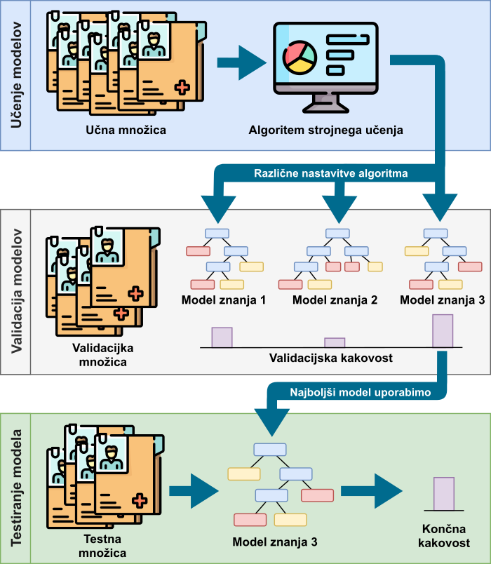
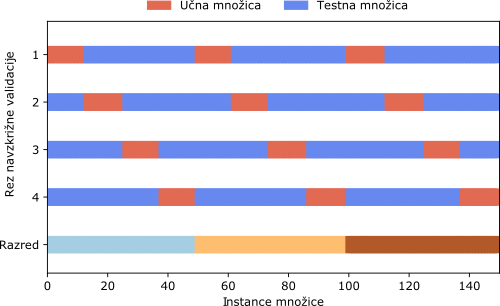

---
tags:
  - prenasičenje
  - točnost klasifikacije
  - F-mera
  - preciznost
  - natančnost
  - priklic
  - senzitivnost
  - navzkrižna validacija
  - testna množica
  - učna množica
  - validacijska množica
---


# Kakovost klasifikacije

Pri iskanju najprimernejšega klasifikatorja je potrebno evalvirati vsako izmed metod. Množica podatkov, na podlagi katere smo model znanja zgradili, mora vsebovati tudi rešitve (dejanske razrede) instanc, zato lahko pravilnost klasifikacije modela znanja preverimo kar s primerjavo napovedi in dejanskih razredov. Tak pristop ni optimalen, saj lahko vodi v _prenasičenje_ (angl. _overfitting_). Pri prenasičenju algoritem vrne model, ki uspešno klasificira podane podatke, vendar je kakovost klasificiranja na novih podatkih tipično zelo slaba. Pravimo, da se je model preveč prilegel učnim podatkom in ni dovolj splošen za dano problematiko. Prenasičeni modeli imajo visoko stopnjo _variance_ (angl. _variance_), kar pomeni, da se preveč prilagajajo majhnemu nihanju in naključnemu šumu v podatkih.

!!! info "Prenasičenost"

    Če primerjamo prenasičene modele z učenjem ljudi, bi lahko rekli, da pride do prenasičenja, če se ljudje naučimo snov dobesedno, ampak brez pravega razumevanja konceptov. Če bi se učili množenja števil, bi se s prenasičenjem naučili na pamet le rezultate množenja števil do $10$ (ker so le ti v učbeniku). Ker pa nismo dojeli koncepta množenja, ne bi poznali rezultata množenja dveh še prej nevidenih števil (primer: $12*27$).


Nasprotje prenasičenju pa je _nenasičenost_ (angl. _underfitting_). Nenasičeni modeli imajo visoko _pristranskost_ (angl. _bias_). To pomeni, da je model preveč splošen, saj ne zazna pomembnih relacij ali zakonitosti.

<figure markdown>
  
  <figcaption>Prikaz variance in pristranskosti.</figcaption>
</figure>

!!! info "Nenasičenost"

    Če se ponovno vrnemo na analogijo učenja množenja dveh števil, bi prišli do nenasičenosti, ko ne bi v celoti dojeli koncepta množenja dveh števil - znali bi množiti dve celoštevilski pozitivni števili, ne pa realnih števil (primer: $6,4*1,34$) ali celo negativnih celih števil (primer: $-7 * 21$).

Praviloma imajo klasifikatorji z visoko pristranskostjo nizko stopnjo variance in obratno. Vedno želimo najti klasifikator s pravim ravnovesjem med pristranskostjo in varianco, a ta meja je arbitrarna in jo določimo sami.

## Delitev podatkov

Da se izognemo prekomernemu prileganju podatkom, je potrebno podatke razdeliti na več delov. Na enem izmed delov se klasifikator uči (klasifikacijski algoritem zgradi klasifikacijski model), na drugih podatkih (na takih, ki niso sodelovali pri procesu učenja) pa se preveri kakovost dobljenega modela.

!!! info "Učna in testna množica"

    Nadaljujmo z analogijo učenja množenja dveh števil. Učno množico dojemimo kot učno gradivo, ki ga uporabljamo za učenje na izpit. Če bi na izpitu dobili enake primere množenja dveh števil, kot smo jih že videli v učnem gradivu, bi preverjali le, če imamo dober spomin, ne pa tudi, če smo dejansko dojeli postopek množenja dveh števil. Tako naj bo izpit sestavljen iz popolnoma novih primerov množenja dveh števil, kar pa v našem postopku ponazorimo z ločeno testno množico. Če je klasifikator dejansko izluščil vzorce iz podatkov, ne bi smel imeti težav pri klasifikaciji novih podatkov. Če se je učne podatke naučil le na pamet, potem pa ne bo dobro klasificiral testnih podatkov (bo padel na izpitu).


### Učna in testna množica

Osnovna razdelitev izvorne množice je z delitvijo na dve podmnožici: _učno množico_ (angl. _train dataset_ ali _learn dataset_) in _testno množico_ (angl. _test dataset_) [^1]. Na učni množici le učimo klasifikatorje, ki pa jih nato testiramo in evalviramo le na testni množici - podatki iz testne množice ne smejo sodelovati pri gradnji klasifikacijskih modelov. Kljub deljenju na učno in testno množico lahko dobimo prenasičen model, a je možnost za to mnogo manjša. Učno množico $X$ smo definirali že prej, testna množica $X'$ pa je definirana spodaj.

\begin{align*}
\label{eq:testna_mnozica}
\begin{split}
X' &= \left\lbrace \left( x'_1,y'_1 \right),\left( x'_2,y'_2 \right), \dots ,\left( x'_m,y'_m \right) \right\rbrace \\
y'_i &\in \left\lbrace razred_1, razred_2, \dots , razred_k \right\rbrace  \\
m &= \text{število instanc v testni množici} \\
\end{split}
\end{align*}

Klasifikacijski model vsaki testni instanci določi razred $\hat{y}$, ki pa ni nujno enak dejanskemu razredu testne instance $y'$ - v tem primeru naredi napako pri klasifikaciji instance. Cilj je najti tak klasifikacijski model, ki pravilno klasificira čim več testnih instanc (idealno vse).

#### Delitev na učno in testno množico v Pythonu

V kodi pa razdelimo podatke na učno in testno množico na sledeč način.

```py
from sklearn.datasets import load_iris
from sklearn.model_selection import train_test_split

# Naložimo podatke
podatki = load_iris(as_frame=True)

# Razdelimo podatke na učne in testne
X_u, X_t, y_u, y_t = train_test_split(podatki.data, 
                                      podatki.target,
                                      train_size=0.7,
                                      random_state=42)
                                      
print(f'Velikost učne množice: {X_u.shape}')
print(f'Velikost učnih razredov: {y_u.shape}')
print(f'Velikost testne množice: {X_t.shape}')
print(f'Velikost testnih razredov: {y_t.shape}')
```
<div class="result" markdown>
```
Velikost učne množice: (105, 4)
Velikost učnih razredov: (105,)
Velikost testne množice: (45, 4)
Velikost testnih razredov: (45,)
```
</div>

S klicem `train_test_split` podane podatke razdelimo na učno in testno množico na tak način, da zadostimo sledečim kriterijem.


- Če podamo parameter `train_size` in je vrednost tega celo število, bo učna množica štela prav toliko instanc. Primer: `train_size=10` pove, da bo učna množica štela točno 10 instanc.
- Če podamo parameter `train_size` in je vrednost tega realno število med 0 in 1, bo učna množica v velikosti deleža izvorne podane množice. Primer: `train_size=0.8` pove, da bo učna množica 80 % velikosti izvorne množice.
- Če podamo parameter `test_size` in je vrednost tega celo število, bo testna množica štela prav toliko instanc. Primer: `test_size=10` pove, da bo testna množica štela 10 instanc.
- Če podamo parameter `test_size` in je vrednost tega realno število med 0 in 1, bo testna množica v velikosti deleža izvorne podane množice. Primer: `test_size=0.2` pove, da bo testna množica 20 % velikosti izvorne množice.


Klicu `train_test_split` smo podali tako izvorno množico atributov `podatki.data`, kakor tudi izvorne razrede `podatki.target`. S tem zagotovimo, da dobimo vrnjene razdeljene tako atribute instanc (učne `X_u` in testne `X_t`), kakor tudi rešitve (učne `y_u` in testne `y_t`).

### Validacijska množica

Če se ukvarjamo s specifičnim problemom podatkovnega rudarjenja, se pri gradnji klasifikacijskih modelov srečamo z optimizacijo parametrov klasifikatorja (na primer definiranja števila sosedov $k$ pri klasifikatorju $k$ najbližjih sosedov). Če parametre prilagajamo glede na rezultate klasifikatorjev na testni množici, delamo napako, saj tako testni podatki sodelujejo pri gradnji optimalnega modela. V tem primeru potrebujemo še _validacijsko množico_ (angl. _validation dataset_), na podlagi katere preizkušamo in optimiziramo parametre, šele na koncu pa zgrajen model testiramo na testni množici [^2].

Slika spodaj prikazuje razdelitev izvorne podatkovne množice na te tri dele: učno množico, validacijsko množico in testno množico. Iz procesa je razvidno, da se nastali modeli znanja najprej preizkusijo na validacijski množici ter se njihova kakovost ovrednoti na tej množici. Šele izbrani (po navadi najboljši) model se uporabi za končno ovrednotenje na testni množici.

<figure markdown>
  {width="500"}
  <figcaption>Delitev množice na učno, validacijsko in testno ter njihova uporaba.</figcaption>
</figure>


#### Delitev na učno, validacijsko in testno množico v Pythonu
V paketu `scikit-learn` ne obstaja klic, s katerim bi dosegli enostavno delitev na tri dele, zato je potrebno, da smo nekoliko zviti.

V prvem klicu `train_test_split` smo pridobili testno množico `X_t`, `y_t` ter _začasno učno_ množico `X_u1`, `y_u1`. Razmerje med njima je $4:1$ v prid začasne učne množice. V drugem klicu `train_test_split` pa začasno učno množico razdelimo na dejansko učno `X_u`, `y_u` ter validacijsko množico `X_v`, `y_v` v razmerju $3:1$. Končno razmerje med učno množico, validacijsko množico in testno množico je tako $3:1:1$.

```py
from sklearn.datasets import load_iris
from sklearn.model_selection import train_test_split

# Naložimo podatke
podatki = load_iris(as_frame=True)

# Razdelimo podatke na 'začasno učne' in testne
X_u1, X_t, y_u1, y_t = train_test_split(podatki.data, podatki.target,
                                        train_size=0.8,
                                        random_state=42)

# 'Začasno učne' podatke razdelimo na 'dejanske učne' in validacijske
X_u, X_v, y_u, y_v = train_test_split(X_u1, y_u1,
                                      train_size=0.75,
                                      random_state=42)
```

Poglejmo kakšne so množice po razdelitvi.

```py
print(f'Velikost učne množice: {X_u.shape}')
print(f'Velikost učnih razredov: {y_u.shape}')
print(f'Velikost validacijske množice: {X_v.shape}')
print(f'Velikost validacijskih razredov: {y_v.shape}')
print(f'Velikost testne množice: {X_t.shape}')
print(f'Velikost testnih razredov: {y_t.shape}')
```
<div class="result" markdown>
```
Velikost učne množice: (90, 4)
Velikost učnih razredov: (90,)
Velikost validacijske množice: (30, 4)
Velikost validacijskih razredov: (30,)
Velikost testne množice: (30, 4)
Velikost testnih razredov: (30,)
```
</div>

### Navzkrižna validacija
Pri deljenju podatkov na učno, testno in validacijsko množico pa lahko zgolj po naključju razdelimo podatke v učno, validacijsko in testno množico, tako da se zgodi ena izmed sledečih stvari:

- kakšen vzorec ni prisoten (v celoti ali v dovolj veliki meri) v učni množici in pri učenju klasifikatorja ta ni zajet v modelu;
- se kakšen, v realnosti neprisoten, vzorec pokaže v učni množici in se ta zapiše v model klasifikacije, v realnosti pa ni uporaben.


!!! info "Navzkrižna validacija"

    Nadaljujemo z analogijo učenja množenja števil. Pri učenju matematične naloge (z rešitvami) razdelimo na dva dela: tiste primere, na katerih se učimo (učno množico) in tiste, na katerih se pred izpitom preverimo, če vemo dovolj (validacijska množica; izpit bo pa testna množica). Če smo po naključju razdelili naloge množenja tako, da se učimo le iz najlažjih (recimo le množenje celih pozitivnih števil), določenega naprednega znanja ne bomo osvojili (množenja negativnih ali realnih števil).


Da zmanjšamo možnost za ponesrečeno razdelitev množice, to razdelimo na več načinov - na $n$ načinov. Tako iz ene množice dobimo $n$ učnih množic in $n$ testnih množic. Ta proces imenujemo _navzkrižna validacija_ (angl. _cross-validation_) in steče tako, da celotno množico razdelimo na $n$ delov - na $n$ _rezov_ (angl. _folds_) [^3]. Vsak rez je enkrat v vlogi testne množice, v vseh ostalih primerih pa je v kombinaciji z ostalimi rezi del učne množice. Posledično je tudi vsaka instanca enkrat v testni množici, v ostalih primerih pa je vedno v učni množici. Sledeča slika prikazuje razdelitev celotne množice na štiri reze za namen navzkrižne validacije.

<figure markdown>
  
  <figcaption>Stratificirana navzkrižna validacija. Vertikalna Y os prikazuje pripadnost instanc bodisi v učno (modra) ali testno (rdeča) množico pri posameznem rezu.</figcaption>
</figure>

Pri naključni delitvi na reze se zna zgoditi, da bodo razmerja med razredi različna med rezi. Tega se želimo izogniti, saj lahko nastane situacija, ko so vse instance enega razreda le v enem rezu. Ko bo ta rez v vlogi testnih instanc, klasifikacijski algoritem nima možnosti, da pravilno klasificira instance tega manjšinskega razreda - saj jih nikoli ne vidi v času učenja. S postopkom _stratifikacije_ (angl. _stratification_) poskrbimo, da se množica premeša na tak način, da so razmerja razredov v vseh rezih kar se da enaka.

V Pythonu razdelimo množico s stratificirano navzkrižno validacijo sledeče.

```py
from sklearn.datasets import load_iris
from sklearn.model_selection import StratifiedKFold

# Naložimo podatke
podatki = load_iris(as_frame=True)

# Stratificirana navzkrižna validacija s štirimi rezi
skf = StratifiedKFold(n_splits=4)

rez = 1 # S tem bomo šteli reze
instanca = 13 # Pregledovali bomo instanco na mestu 13

print(f'Zanima nas instanca {instanca} s podatki:')
print(podatki.data.iloc[instanca,:])

for ucne, testne in skf.split(podatki.data, podatki.target):
    if instanca in ucne:
        print(f'Instanca {instanca} je v {rez}. delitvi v učni množici.')
    elif instanca in testne:
        print(f'Instanca {instanca} je v {rez}. delitvi v testni množici.')
    rez = rez + 1
```
<div class="result" markdown>
```
Zanima nas instanca 13 s podatki:
 sepal length (cm)    4.3 
 sepal width (cm)     3.0
 petal length (cm)    1.1
 petal width (cm)     0.1
Name: 13, dtype: float64
 Instanca 13 je v 1. delitvi v učni množici.
 Instanca 13 je v 2. delitvi v testni množici.
 Instanca 13 je v 3. delitvi v učni množici.
 Instanca 13 je v 4. delitvi v učni množici.
```
</div>

Z uporabo razreda `StratifiedKFold` in njegove metode `split` razdelimo podane podatke na reze. Z vrednostjo `n_splits` ob inicializaciji podamo, na koliko rezov delimo množico. V `for` zanki tako na vsaki učni množici naučimo svoj model klasifikacije, ki ga evalviramo na testni množici tistega reza. Tako dobimo $n$ klasifikacijskih modelov, vsak se je naučil na nekoliko drugačni učni množici in vsak se je evalviral na popolnoma drugačni testni množici. Iz tega sledi, da dobimo tudi $n$ rezultatov klasifikacije na testnih množicah. Da pa ocenimo celokupno kakovost podanega klasifikacijskega algoritma, pa vse rezultate preprosto povprečimo. Sledi poglavje, ki pregleda, kako sploh merimo kakovost klasifikacije, razdeljeno glede na število razredov, v katere model klasifikacije razvršča instance.

## Metrike klasifikacije

Ko imamo napovedi modela, lahko ovrednotimo oz. evalviramo kakovost te napovedi. To naredimo s pomočjo _klasifikacijskih metrik_ (angl. _classification metrics_)
[^4]^,^[^5]^,^[^6]^,^[^7]. Sledi pregled različnih klasifikacijskih metrik, najprej, ko imamo opravka s klasifikacijo v dva razreda (dvorazredna ali binarna klasifikacija) in nato, ko imamo opravka z več kot dvema razredoma (večrazredna klasifikacija).

### Binarna klasifikacija

Pri binarnih klasifikatorjih gradimo model za klasifikacijo instanc v dva razreda. Ko imamo model zgrajen, ga ocenimo s pomočjo testnih podatkov in iz rezultatov zgradimo _matriko zmede_ ali _kontingenčno tabelo_ (angl. _confusion matrix_ ali _contingency table_), ki je prikazana v spodnji tabeli.

<figure markdown>
|          | Napovadan _A_ | Napovedan _B_ |
|:---------|:--------:|:------:|
| **Dejanski _A_** | TP       | FN    |
| **Dejanski _B_**  | FP        | TN    |
<figcaption>Matrika zmede za dva razreda.</figcaption>
</figure>

V danem primeru klasificiramo podatke v dva razreda: A in B. Vsaka celica v tabeli prikazuje število instanc. Vrstice matrike kažejo dejansko pripadnost instanc v razrede, stolpci pa povedo razporeditev instanc v razrede s pomočjo klasifikatorja. Enemu razredu pripišemo lastnost pozitivnega razreda, drugemu pa lastnost negativnega razreda. Ta določitev je arbitrarna in je odvisna od problematike reševanja - pravilne določitve ni in bi tudi druga delitev v pozitivne in negativne vrnila prave rezultate.

```py
from sklearn.metrics import confusion_matrix

# Podamo dejanske razrede in napovedi klasifikatorja
y_dejanski = ['A', 'A', 'B', 'B', 'A', 'B']
y_napovedan = ['A', 'A', 'B', 'A', 'A', 'B']

# Izračunamo matriko zmede
mat_zmede = confusion_matrix(y_dejanski, y_napovedan, labels=['A', 'B'])
print(mat_zmede)
```
<div class="result" markdown>
```
[[3 0]
 [1 2]]
```
</div>

Klicu `confusion_matrix` podamo vsaj dve vrednosti: polje dejanskih razredov in polje napovedi. Pomembno je, da so elementi v obeh poljih v enakem vrstnem redu (prvi element v obeh poljih kaže tako dejanski razred kot napoved prvega elementa). S parametrom `labels` pa podamo vrstni red razredov pri kreaciji matrike zmede - če tega ne podamo, bo vrstni red razredov po abecednem vrstnem redu.

V primeru iz kode vidimo, da je klasifikacijski model za tri instance razreda A povedal, da so res razreda A; za dve instanci razreda B je povedal, da sta res razreda B; ter za eno instanco razreda B je napačno povedal, da je ta razreda A. Če privzamemo, da je razred A pozitiven, matrika zmede binarne klasifikacije vsebuje štiri vrednosti, ki kažejo količino instanc glede na rezultate klasifikacije:

- **TP** - _pravilno_ klasificirane kot _pozitivne_  (angl. _true positives_),
- **FP** - _napačno_ klasificirane kot _pozitivne_  (angl. _false positives_),
- **TN** - _pravilno_ klasificirane kot _negativne_  (angl. _true negatives_),
- **FN** - _napačno_ klasificirane kot _negativne_  (angl. _false negatives_).


Razširimo prejšnji primer z naslednjo kodo, ki nam vrne te štiri vrednosti (deluje le pri binarni klasifikaciji). Klicu metode `confusion_matrix` dodamo še klic metode `ravel`, ki dobljeno metriko zloži v enodimenzionalno polje (najprej vse iz prve vrstice, nato vse iz druge vrstice ...).

```py
# Izračunamo vrednosti napovedi
tp, fn, fp, tn = confusion_matrix(y_dejanski, y_napovedan, labels=['A', 'B']).ravel()

print(f'TP: {tp}')
print(f'TN: {tn}')
print(f'FP: {fp}')
print(f'FN: {fn}')
```
<div class="result" markdown>
```
TP: 3
TN: 2
FP: 1
FN: 0
```
</div>

S pomočjo teh štirih vrednosti lahko izračunamo različne _metrike klasifikacije_ (angl. _classification metrics_) oziroma vrednosti, ki nam povedo, kako kakovosten je klasifikacijski model. Teh metrik je več in vsaka služi svojemu namenu - obstajajo tudi različni pogledi, kaj sploh pomeni _kakovosten_ model znanja.

#### Točnost klasifikacije in delež napake

Prva taka metrika je _točnost_ klasifikacije (angl. _accuracy_), ki prikazuje, kolikšen deležen instanc je klasificiran v dejanski razred - delež pravilno klasificiranih instanc. Formula točnosti je prikazana v sledeči enačbi in se izračuna kot ulomek števila pravilno klasificiranih instanc ($TP + TN$) deljeno s številom vseh klasificiranih instanc ($TP + FP + TN + FN$). Metriko točnost želimo maksimirati in težimo k temu, da je čim bližje vrednosti 1 [^8].

\begin{equation*}
    to\check{c}nost = \frac{TP + TN}{TP + FP + TN + FN}
\end{equation*}

Metrika, ki kaže nasprotno vrednost točnosti, je _delež napake_ (angl. _error rate_); pravimo tudi, da je obratno sorazmerna kot točnost. Predstavlja delež nepravilno klasificiranih instanc, kar je prikazano v spodnji enačbi. Lahko pa delež napake izračunamo tudi preprosto kot $1 - to\check{c}nost$. Delež napake je metrika, ki jo minimiziramo in katere idealna vrednost je $0$.

\begin{equation*}
dele\check{z}\:napake = \frac{FP + FN}{TP + FP + TN + FN}
\end{equation*}

Prikažimo še izračun točnosti, deleža napake in števila pravilno klasificiranih instanc v Pythonu s klicem `accuracy_score`.

```py
from sklearn.metrics import accuracy_score

# Podamo dejanske razrede in napovedi klasifikatorja
y_dejanski = ['A', 'A', 'B', 'B', 'A', 'B']
y_napovedan = ['A', 'A', 'B', 'A', 'A', 'B']

# Izračunamo točnost
tocnost = accuracy_score(y_dejanski, y_napovedan)
delez_napake = 1 - tocnost

# Izračunamo število pravilno klasificiranih (TP+TN)
st_pravilnih = accuracy_score(y_dejanski, y_napovedan, normalize=False)

print(f'Točnost: {tocnost}')
print(f'Delež napake: {delez_napake}')
print(f'Število pravilnih: {st_pravilnih}')
```
<div class="result" markdown>
```
Točnost: 0.8333333333333334
Delež napake: 0.16666666666666663
Število pravilnih: 5
```
</div>

#### Priklic in preciznost

Naslednji dve metriki, ki ju bomo obravnavali skupaj, sta priklic in preciznost. Obe metriki imata vrednost v intervalu $[0,1]$, kjer je 0 najslabša vrednost, 1 pa najboljša.

Metrika _priklic_ (angl. _recall_)  nam pove delež pozitivnih instanc, ki so pravilno klasificirane v pozitivni razred. Včasih priklic imenujemo tudi _senzitivnost_ (angl. _sensitivity_) ali _delež pravilno klasificiranih pozitivnih instanc_ (angl. _true positive rate_). Izračun priklica je prikazan v sledeči enačbi.

\begin{equation*}
priklic = \frac{TP}{TP + FN}
\end{equation*}

Poglejmo si uporabo priklica v Pythonu.

```py
from sklearn.metrics import recall_score

# Podamo dejanske razrede in napovedi klasifikatorja
y_dejanski = ['A', 'A', 'B', 'B', 'A', 'B']
y_napovedan = ['A', 'A', 'B', 'A', 'A', 'B']

# Izračunamo priklic obeh razredov
priklic_A = recall_score(y_dejanski, y_napovedan, pos_label='A')
priklic_B = recall_score(y_dejanski, y_napovedan, pos_label='B')

print(f'Priklic A: {priklic_A}')
print(f'Priklic B: {priklic_B}')
```
<div class="result" markdown>
```
Priklic A: 1.0
Priklic B: 0.6666666666666666
```
</div>

Podobno kot pri izračunu točnosti, tudi pri klicu metode `recall_score` podamo najprej polje z dejanskimi razredi, čemur pa sledi polje z napovedanimi razredi. Pri binarni klasifikaciji moramo podati tudi parameter `pos_label`, s katerim določimo razred, za katerega računamo priklic.

!!! info "Priklic oz. senzitivnost testa"

    O senzitivnosti (ali občutljivosti) testa v praksi zelo pogosto govorimo, ko imamo opravka s testom, ki ugotavlja prisotnost ali odsotnost določenega obolenja (npr. bolezni, ki jo povzroča virus). Senzitivnost takega testa nam pove kakšen je delež bolnih, ki jih je test našel. Predstavljajmo si primer, ko imamo 100 pacientov, ki so dejansko bolni. Test je za dejansko bolne pokazal, da jih je 80 bolnih, za ostalih 20 pa je test (napačno) trdil, da niso bolni. Tak test ima $80 %$ senzitivnost oz. priklic.


Druga metrika je _preciznost_ (angl. _precision_ in nam pove, kolikšen delež instanc, klasificiranih v pozitivni razred, je dejansko pripadnikov pozitivnega razreda. Včasih metriko priklic imenujemo _zaupanje_ (angl. _confidence_) ali _točnost pozitivno klasificiranih pozitivnih instanc_ (angl. _true positive accuracy_).

\begin{equation*}
preciznost = \frac{TP}{TP + FP}
\end{equation*}

Sledeča koda prikazuje uporabo klica `precision_score`.

```py
from sklearn.metrics import precision_score

# Izračunamo preciznost obeh razredov
preciznost_A = precision_score(y_dejanski, y_napovedan, pos_label='A')
preciznost_B = precision_score(y_dejanski, y_napovedan, pos_label='B')

print(f'Preciznost A: {preciznost_A}')
print(f'Preciznost B: {preciznost_B}')
```
<div class="result" markdown>
```
Preciznost A: 0.75
Preciznost B: 1.0
```
</div>

Ponovno se vrnimo na primer testa za ugotavljanje določenega obolenja. Imamo 100 pacientov, ki so dejansko bolni. Test je za 80 izmed teh pokazal, da so bolni, za še 10 dodatnih (dejansko zdravih) pacientov pa je prav tako (napačno) pokazal, da so bolni. Tak test ima $88,89 %$ preciznosti oz. zaupanja.

#### F-mera

Iz prejšnjih sekcij je razvidno, da obstaja nabor metrik za merjenje kakovosti binarne klasifikacije, od katerih ima vsaka svoj namen. Ko želimo meriti kakovost klasifikacijskega modela v splošnem, pa  uporaba večjega števila metrik ni praktična. V ta namen uporabljamo metriko, imenovano _F-mera_ (angl. _F-score_ ali _F-measure_), ki združi metriki priklic in preciznost v harmonični sredini, kot je prikazano v enačbi spodaj. Metriki preciznost in priklic nista neposredno povezani in prikazujeta različne informacije. Visoka vrednost ene ne pomeni nujno nizke vrednosti druge, zato stremimo k temu, da bi obe metriki bili dovolj visoki. Prednost F-mere je, da združi obe omenjeni metriki skupaj v eno število, kjer se takoj opazi nizka vrednost katerekoli izmed njiju.

\begin{align*}
\begin{split}
F\text{-}mera_\beta &= (1 + \beta^2) \cdot \frac{preciznost \cdot priklic}{(\beta^2 \cdot preciznost) + priklic}
\\[.3cm]
&= \frac{(1 + \beta^2) \cdot TP}{(1 + \beta^2) \cdot TP + \beta^2 \cdot FN + FP}
\end{split}
\end{align*}

Ta enačba prikazuje splošno obliko F-mere, kjer lahko posamezno metriko (preciznost ali priklic) utežimo pri končnem izračunu. Vlogo uteži igra vrednost $\beta$, ki je višja pri večji pomembnosti metrike preciznost in nižja, ko damo večji poudarek metriki priklica. Tradicionalna oblika metrike F-mera je, ko sta obe vrednosti enako uteženi in imata uravnoteženo vlogo pri izračunu (ko je $\beta=1$). Največkrat se uporablja prav ta, ki se včasih imenuje tudi F$_{1}$-mera in je prikazana s sledečo enačbo.

\begin{equation*}
F_1\text{-}mera = 2 \cdot \frac{preciznost \cdot priklic}{preciznost + priklic}
\end{equation*}

Če uporabljamo pri izračunu F-mere vrednost $\beta$, ki ni enaka $1$, se to zapiše kot podpisana vrednost (F$_2$-mera ali F$_{0,5}$-mera). Če pa je $\beta$ enak vrednosti $1$, lahko podpisano vrednost izpustimo in zapišemo le F-mera.

Sledeča Python koda prikazuje izračun F-mere z in brez podane $\beta$ vrednosti. Koda razširja prejšnje primere, kjer so dejanski in napovedani razredi že definirani.

```py
from sklearn.metrics import f1_score, fbeta_score

# Izračunamo F-mero in F-meta (s podano beto) razreda A
f1_score_A = f1_score(y_dejanski, y_napovedan, pos_label='A')
f_beta_score_A = fbeta_score(y_dejanski, y_napovedan, pos_label='A', beta=2)

print(f'F1-mera A: {f1_score_A}')
print(f'F-mera (beta=2) A: {f_beta_score_A}')
```
<div class="result" markdown>
```
F1-mera A: 0.8571428571428571
F-mera (beta=2) B: 0.9375
```
</div>

### Klasifikacija v več razredov

V prejšnji sekciji smo naredili pregled metrik za ocenjevanje kakovosti modelov klasifikacije v dva razreda. Mnogokrat pa imajo podatki več možnih razredov, zato evalvacija teh modelov z metrikami, neprilagojenimi za več razredov, postane težavna. Kreacija matrike zmede poteka po enakem postopku kot pri binarni klasifikaciji, kjer v vrstice beležimo dejanske, v stolpce pa napovedane razrede instanc, kot kaže sledeča tabela.

<figure markdown>
|          | Napovadan _A_ | Napovedan _B_ | Napovedan _C_ |
|:---------|:--------:|:------:|:----:|
| **Dejanski _A_** | 50 | 1 | 2 |
| **Dejanski _B_** | 4 | 20 | 0 |
| **Dejanski _C_** | 5 | 1 | 10 |
<figcaption>Matrika zmede za več razredov.</figcaption>
</figure>

Najpreprostejša metrika za izračun ne glede na število razredov je točnost, saj še vedno velja, da število pravilno klasificiranih instanc delimo s številom vseh instanc. Podobno velja tudi za delež napake, le da število pravilno klasificiranih zamenjamo s številom nepravilno klasificiranih primerkov.

Težava nastopi pri poimenovanju pozitivnih in negativnih razredov, saj smo prisiljeni oznako pozitivni ali negativni dodeliti več razredom. Vse metrike, ki vsebujejo število pozitivnih ali negativnih instanc, se morajo prilagoditi uporabi klasifikacije v več razredov na sledeč način. Te metrike računamo v več korakih, kjer v vsakem koraku dobi naziv pozitivnega razreda drug razred, ostali pa predstavljajo negativni razred. Končno vrednost metrik dobimo na več načinov: z _makro_ agregacijo, z _uteženim povprečenjem_, ali z _mikro_ agregacijo [^9].

#### Makro agregacija metrik

Pri _makro agregaciji metrik_ klasifikacije izdelamo več matrik zmede ($m$ matrik zmede, če imamo $m$ razredov), in sicer tako, da je v vsaki metriki zmede drug razred označen kot pozitivni razred. Za vsako matriko zmede izračunamo izbrano metriko (dobimo $m$ metrik klasifikacije). Končno vrednost metrike klasifikacije pa na koncu izračunamo tako, da povprečimo vseh $m$ metrik. Sledeče enačbe  prikazujejo makro ($Ma$) izračun nekaterih metrik klasifikacije.

\begin{align*}
priklic_{Ma} &= \frac{\sum_{i=1}^{m} \frac{TP_i}{TP_i + FN_i}}{m} = \frac{\sum_{i=1}^{m} priklic_{i}}{m}
\\[.2cm]
preciznost_{Ma} &= \frac{\sum_{i=1}^{m} \frac{TP_i}{TP_i + FP_i}}{m} = \frac{\sum_{i=1}^{m} preciznost_{i}}{m}
\\[.2cm]
F_1\text{-}mera_{Ma} &= \frac{\sum_{i=1}^{m} F_1\text{-}mera_{i}}{m}
\end{align*}

Čeprav se metrika točnost izračuna za _m_ razredov enako kot za binarni problem klasifikacije, pa lahko izračunamo metriko _povprečna točnost_ (angl. _average class accuracy_). Ta metrika izračuna najprej točnost za vsak posamezni razred, nato pa povpreči izračunane vrednosti. Po enakem postopku izračunamo tudi _povprečno stopnjo napake_ (angl. _average class error rate_), le da povprečimo deleže napak razredov.

\begin{align*}
povpre\check{c}na\:to\check{c}nost &= \frac{\sum_{i=1}^{m} \frac{TP_i+TN_i}{TP_i + FP_i + TN_i + FN_i}}{m}
\\[.2cm]
povpre\check{c}en\:dele\check{z}\:napake &= \frac{\sum_{i=1}^{m} \frac{FP_i+FN_i}{TP_i + FP_i + TN_i + FN_i}}{m}
\end{align*}

#### Utežena agregacija metrik

Preprosto povprečenje metrik vsakega razreda največkrat ni smiselno. Ko imamo neuravnoteženo množico (tj. množico, ko je razmerje med razredi zelo neenakomerno - čez $8:1$), povprečenje kakovosti klasifikacije instanc pogostega razreda in kakovosti instanc redkih razredov ni smiselno. Namreč, več instanc imamo, več možnosti ima klasifikacijski algoritem, da izlušči vzorce, ki so značilni za instance tega razreda. To privede do klasifikacijskih modelov, ki delujejo mnogo boljše pri klasifikaciji instanc bolj pogostega razreda v primerjavi s klasifikacijo instanc redkih razredov. Če kakovost klasifikacije povprečimo (kot je to pri makro agregaciji), kakovost klasifikacije vseh razredov enakomerno prispeva h končni metriki. To je odlično, če želimo večji poudarek na kakovosti manjšinskih instanc. Če pa ne želimo, da instance v manjšini prevzamejo neenakomerno večjo vlogo pri ocenjevanju kakovosti, pa lahko posamezne metrike pred povprečenjem utežimo.

Pri uteževanju metriko posameznega razreda $i$ zmnožimo z deležem instanc $u_i$ razreda $i$, zmnožene metrike pa nato seštejemo v skupno mero. Delež razreda $u_i$ je preprost odstotek instanc tega razreda $i$ v testni množici.

\begin{align*}
priklic_{Ua} &= \sum_{i=1}^{m} u_i \cdot \frac{TP_i}{TP_i + FN_i} = \sum_{i=1}^{m} u_i \cdot priklic_{i}
\\[.2cm]
preciznost_{Ua} &= \sum_{i=1}^{m} u_i \cdot \frac{TP_i}{TP_i + FP_i} = \sum_{i=1}^{m} u_i \cdot preciznost_{i}
\\[.2cm]
F_1\text{-}mera_{Ua} &= \sum_{i=1}^{m}  u_i \cdot F_1\text{-}mera_{i}
\end{align*}

#### Mikro agregacija metrik

Pri _mikro agregaciji metrik_ začnemo podobno kot pri makro agregaciji; zgradimo $m$ matrik zmede, nadaljnji postopek pa je drugačen. Namesto povprečenja različnih metrik seštejemo posamezne vrednosti iz matrik zmede. Primer: vse $TP_i$ seštejemo skupaj, da dobimo $TP_{Mi}$, in tega vstavimo v enačbo za izračun mikro agregiranih metrik. Enačbe spodaj prikazujejo način izračuna posameznih metrik na mikro ($Mi$) način.

\begin{align*}
priklic_{Mi} &= \frac{\sum_{i=1}^{m} TP_i}{\sum_{i=1}^{m} (TP_i + FN_i)}
\\[.2cm]
preciznost_{Mi} &= \frac{\sum_{i=1}^{m} TP_i}{\sum_{i=1}^{m} (TP_i + FP_i)}
\\[.2cm]
F_1\text{-}mera_{Mi} &= 2 \cdot \frac{preciznost_{Mi} \cdot priklic_{Mi}}{preciznost_{Mi} + priklic_{Mi}}
\end{align*}

Posebnih mikro agregacij točnosti in deleža napake ni, saj v tem primeru dobimo že prej definirano točnost in delež napake.

#### Agregacija metrik v Pythonu

Z uporabo knjižnice `scikit-learn` in že do sedaj predstavljenih metod `accuracy_score`, `precision_score`, `recall_score` in `f1_score` enostavno agregiramo metrike vseh razredov v eno vrednost. Pri agregaciji nam služi parameter teh metod `average`, s katerim podamo način agregacije.

```py
from sklearn.metrics import precision_score, recall_score, f1_score

# Izračunamo preciznost z makro agregacijo
preciznost_makro = precision_score(y_dejanski, y_napovedan, average='macro')

# Izračunamo utežen priklic
priklic_utezen = recall_score(y_dejanski, y_napovedan, average='weighted')

# Izračunamo mikro F-mero
f_mera_mikro = f1_score(y_dejanski, y_napovedan, average='micro')

# Izračunamo ločeno preciznost za vsak razred
preciznost_vseh = precision_score(y_dejanski, y_napovedan, average=None)

print(f'Makro preciznost: {preciznost_makro}')
print(f'Utežen priklic: {priklic_utezen}')
print(f'Mikro F-mera: {f_mera_mikro}')
print(f'Preciznost vseh razredov: {preciznost_vseh}')
```
<div class="result" markdown>
```
Makro preciznost: 0.875
Utežen priklic: 0.8333333333333334
Mikro F-mera: 0.8333333333333334
Preciznost vseh razredov: [0.75 1.  ]
```
</div>

Vrednost parametra `average` določa način agregacije:

- `'macro'` se uporabi za makro agregacijo.
- `'weighted'` se uporabi za uteženo agregacijo, kjer so uteži sestavljene iz razmerja razredov v podani testni množici.
- `'micro'` se uporabi za mikro agregacijo.
- `None` se uporabi, ko želimo ločen izpis metrike za vsak razred posebej, brez agregacije.


[^1]: Lever, J., 2016. Classification evaluation: It is important to understand both what a classification metric expresses and what it hides. Nature Methods, 13(8), pp.603-605.
[^2]: Guyon, I., 1997. A scaling law for the validation-set training-set size ratio. AT&T Bell Laboratories, 1(11).
[^3]: Schaffer, C., 1993. Selecting a classification method by cross-validation. Machine Learning, 13(1), pp.135-143.
[^4]: Hossin, M. and Sulaiman, M.N., 2015. A review on evaluation metrics for data classification evaluations. International journal of data mining & knowledge management process, 5(2), p.1.
[^5]: Powers, D.M., 2020. Evaluation: from precision, recall and F-measure to ROC, informedness, markedness and correlation. arXiv preprint arXiv:2010.16061.
[^6]: Sokolova, M., Japkowicz, N. and Szpakowicz, S., 2006, December. Beyond accuracy, F-score and ROC: a family of discriminant measures for performance evaluation. In Australasian joint conference on artificial intelligence (pp. 1015-1021). Springer, Berlin, Heidelberg.
[^7]: Sokolova, M. and Lapalme, G., 2009. A systematic analysis of performance measures for classification tasks. Information processing & management, 45(4), pp.427-437.
[^8]: Demšar, J., 2006. Statistical comparisons of classifiers over multiple data sets. The Journal of Machine Learning Research, 7, pp.1-30.
[^9]: Jurman, G. and Furlanello, C., 2010. A unifying view for performance measures in multi-class prediction. arXiv preprint arXiv:1008.2908.